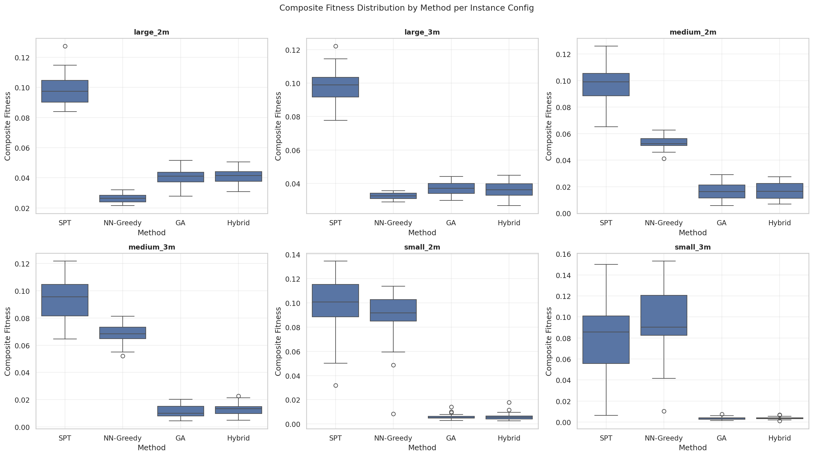
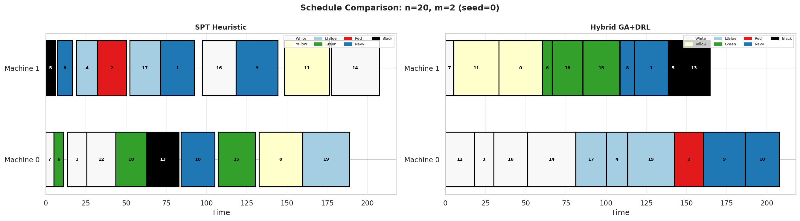

# Chapter 4. Software Implementation and Results

## 4.1 Implementation

This section describes the implementation of each software component, following the system design from Chapter 3. All components are implemented in Python 3.11 and depend on the libraries specified in `requirements.txt`.

### 4.1.1 Instance Generator

The instance generator (`src/instance_generator.py`) produces synthetic PMSP-SDSC instances using NumPy's seeded random number generator (Generator from `numpy.random.default_rng`). Each instance is a dictionary containing: number of jobs n, number of machines m, processing times, due dates, job weights (all ones for the unweighted case), release times (all zero for the baseline case), setup cost matrix, setup time matrix, and colour class assignments.

Processing times are drawn uniformly from the range 5 to 31. Each job is assigned one of seven colour classes (white through black), each with a relative darkness ranking from 1 to 7. The setup cost matrix is constructed asymmetrically: the cost of transitioning from job i to job j depends on the difference in darkness between their colours:

S[i][j] = max(0, darkness[i] - darkness[j]) * 10 + noise

where noise is drawn uniformly from [0, 2]. This ensures dark-to-light transitions are costly while light-to-dark transitions are near zero. The setup time matrix is derived from the cost matrix scaled by a random factor in [0.8, 1.2], representing time as a noisy proportional cost.

Due dates are calibrated relative to processing times. The total processing workload is distributed across machines, and each job's due date is set proportional to its share of total processing time, scaled by a tightness parameter (default 1.5). A small uniform perturbation is added to prevent degenerate perfect-knowledge solutions.

Six standard configurations are generated:

| Label | n | m |
|-------|---|---|
| small_2m | 10 | 2 |
| small_3m | 10 | 3 |
| medium_2m | 20 | 2 |
| medium_3m | 20 | 3 |
| large_2m | 50 | 2 |
| large_3m | 50 | 3 |

### 4.1.2 Evaluator

The evaluator (`src/evaluator.py`) is a pure function that computes all scheduling metrics for a given solution-instance pair. It has no side effects, no dependencies on global state, and produces deterministic output for identical inputs.

The evaluation pipeline proceeds as follows. First, the solution sigma is validated to ensure every job appears exactly once. Second, completion times are computed sequentially on each machine. The completion time algorithm proceeds as shown in the pseudocode below:

```
for each machine sequence sigma[k]:
    t = 0
    for each job j in sigma[k]:
        t = max(t, release[j])
        if j is not the first job:
            prev = previous job in sigma[k]
            t += setup_time[prev][j]
        t += proc_time[j]
        C[j] = t
```

This formulation accounts for three key aspects of the scheduling environment: machines can begin processing before the release time of their first job (they remain idle until the first job is available), setup times are inserted between consecutive jobs based on their specific pair, and jobs cannot be processed in parallel on the same machine.

Third, job tardiness is calculated as max(0, completion time - due date). Fourth, weighted tardiness (f1) and setup cost (f2) are computed.

Normalisation is a critical step: without it, weighted tardiness can exceed setup cost by an order of magnitude on large instances, causing the composite objective to ignore setup cost entirely. The `estimate_scales` function computes upper bounds for each objective component. The weighted tardiness scale is the maximum possible tardiness assuming all jobs complete at the worst-case completion time. The setup cost scale is the maximum possible cost assuming the most expensive transition for every consecutive pair. These scales ensure both objectives contribute meaningfully to the final composite score:

composite = alpha * f1_norm + (1 - alpha) * f2_norm

### 4.1.3 Baseline Heuristics

Two baseline heuristics are implemented in `src/heuristics.py`.

The Shortest Processing Time heuristic sorts jobs by ascending processing time and assigns them round-robin to machines. Its time complexity is O(n log n), dominated by the sorting step. SPT is included because it is the most widely used baseline in scheduling literature, despite ignoring setup costs entirely.

The Nearest-Neighbour Greedy heuristic builds machine schedules by repeatedly selecting the machine with the lowest current load and assigning the unscheduled job that minimises the setup cost from that machine's last job. For a machine's first job, the job with the lowest processing time is selected. NN-Greedy accounts for setup costs but makes locally optimal decisions that may lead to poor global solutions.

Both heuristics produce a complete solution for any valid instance without requiring parameters.

### 4.1.4 Genetic Algorithm

The GA (`src/ga.py`) is implemented using the DEAP framework. The chromosome encoding uses the giant-tour representation: a flat permutation of n job indices. Decoding splits this permutation into m approximately equal segments, with the first n mod m machines receiving one additional job each. The decoding algorithm is:

```
function decode_chromosome(individual, m):
    n = len(individual)
    sigma = []
    per_machine = n // m
    remainder = n % m
    start = 0
    for k in range(m):
        size = per_machine + (1 if k < remainder else 0)
        sigma.append(individual[start:start + size])
        start += size
    return sigma
```

This decoder ensures that any permutation of n jobs maps to a valid schedule, with each job appearing exactly once across the m machine sequences. The equal-ish split prevents any machine from receiving a disproportionate number of jobs, which could lead to load imbalance.

The DEAP toolbox is configured with:
- **Individual**: a permutation of job indices initialised via `random.sample`
- **Crossover**: Order Crossover (OX), which preserves relative job ordering
- **Mutation**: three operators registered separately: shuffle indexes with indpb=0.05 (swap), inversion, and shuffle indexes with indpb=0.20 (aggressive swap)
- **Selection**: tournament selection with tournament size 3
- **Elitism**: HallOfFame of size 1 preserves the best individual

DEAP's `creator` module registers global classes (FitnessMin and Individual). To prevent re-registration errors in notebook environments, `hasattr` guards check whether each class already exists before creation.

The `run_ga` function accepts parameters for population size, number of generations, crossover and mutation probabilities, alpha weighting, random seed, and mutation strategy. It returns the best solution found along with evaluation metrics and the DEAP logbook for convergence analysis.

### 4.1.5 GA Environment

The Gymnasium environment (`src/ga_env.py`) wraps the GA execution loop for reinforcement learning. An episode corresponds to one complete GA run, and each step corresponds to a fixed number of GA generations (step_gens, default 10) with the mutation operator selected by the PPO agent.

The observation space is a 4-dimensional Box with range [0, 1]:

- best_norm: current best fitness divided by the initial best fitness at episode start. This decreases from 1 toward 0 as the GA improves.
- mean_norm: population mean fitness divided by initial best fitness, indicating the degree of population convergence.
- diversity: mean pairwise normalised Hamming distance across a sample of individuals, measuring remaining exploration potential.
- stagnation: number of consecutive steps without improvement divided by the maximum steps, detecting plateaus.

The action space is Discrete(3):
- Action 0: swap mutation (indpb = 0.05) — conservative fine-tuning
- Action 1: inversion mutation — moderate disruption
- Action 2: aggressive swap mutation (indpb = 0.20) — high exploration

The reward at each step is the relative improvement in best fitness:

reward = (best_before - best_after) / max(best_before, 1e-6)

A plateau penalty of -0.01 replaces zero reward to discourage idle behaviour that neither helps nor hurts.

The step loop follows the standard GA generational cycle: selection, cloning, crossover (applied with probability cx_prob to pairs of offspring), mutation (applied with probability mut_prob to each offspring), evaluation of invalid individuals, population replacement, and HallOfFame update.

Episode termination is signalled when the step counter reaches the maximum number of steps (total_gens / step_gens). This is correctly signalled as a time-limit truncation rather than a terminal state, ensuring proper value bootstrapping during PPO training.

During training, each call to reset() randomly samples an instance from the training pool, forcing the agent to learn a generalisable policy.

### 4.1.6 PPO Agent

The PPO agent (`src/drl_agent.py`) interfaces Stable-Baselines3's PPO implementation with the custom Gymnasium environment. The `train_ppo` function creates a vectorised environment using DummyVecEnv, configures the PPO model with MlpPolicy and standard hyperparameters, trains for a specified number of timesteps, and saves the trained model.

The PPO hyperparameters are:

| Parameter | Value |
|-----------|-------|
| Learning rate | 3e-4 |
| Steps per update (n_steps) | 512 |
| Batch size | 64 |
| Epochs per update (n_epochs) | 10 |
| Discount factor (gamma) | 0.99 |
| Entropy coefficient | 0.01 |

The training environment uses a reduced population size of 50 (compared to the GA's 100), intentionally making each episode harder for the GA to improve on its own. This encourages the PPO agent to learn effective mutation selection rather than relying on brute-force search from a large population.

Training runs for 100,000 timesteps on a diversified instance pool of 60 instances (6 configurations x 10 seeds). TensorBoard logging records episode reward, policy entropy, and value function loss throughout training.

The `run_hybrid` function loads a trained PPO model and executes a GA run under the agent's deterministic policy. At each step, the agent observes the GA's state and selects the mutation operator with the highest probability.

### 4.1.7 Experiment Pipeline

The experiment pipeline consists of five standalone scripts in `experiments/`:

**train_ppo.py**. Generates 60 training instances (6 configurations x 10 seeds) and trains the PPO agent. The model is saved to `models/ppo_hyperheuristic.zip`. Training takes approximately 30-60 minutes on a modern CPU.

**run_baselines.py**. Executes SPT and NN-Greedy on all 6 configurations with 30 seeds each (180 runs per heuristic). Runs are sequential as each is O(n log n) or O(n^2 m). Results are saved to `results/raw/baselines.json`.

**run_ga.py**. Executes the GA on all 6 configurations with 30 seeds each (180 runs total). Runs are parallelised using `get_context("spawn").Pool()` with all available CPU cores. Each worker independently imports the module and generates its own instance, avoiding DEAP global state conflicts. Results are saved to `results/raw/ga.json`.

**run_hybrid.py**. Loads the trained PPO model and executes hybrid GA+PPO runs on all 6 configurations with 30 seeds each (180 runs total). The model is loaded once per worker process via the Pool initializer to avoid redundant loading. Results are saved to `results/raw/hybrid.json`.

**run_sensitivity.py**. Executes GA and Hybrid on medium configurations (medium_2m, medium_3m) with alpha values of 0.3, 0.5, and 0.7, using 10 seeds each. Results are saved to `results/raw/sensitivity.json`.

## 4.2 Results

### 4.2.1 Computational Effort

The total experimental runtime was approximately 3-4 hours on a 12-core CPU (AMD Ryzen 5), with the majority of time consumed by the GA (1-1.5 hours) and hybrid (30-40 minutes) experiments. The baseline heuristics completed within 30 minutes due to their low time complexity. PPO training required approximately 45 minutes. The sensitivity analysis completed in under 10 minutes.

### 4.2.2 Performance Comparison

Table 4.1 presents the mean composite scores for all four algorithms across all six instance configurations, with the best result in each row shown in bold.

| Config | SPT | NN-Greedy | GA | Hybrid |
|--------|-----|-----------|-----|--------|
| large_2m | 0.299 | 0.160 | 0.088 | **0.033** |
| large_3m | 0.297 | 0.139 | 0.078 | **0.014** |
| medium_2m | 0.111 | 0.065 | 0.015 | **0.005** |
| medium_3m | 0.107 | 0.079 | 0.007 | **0.003** |
| small_2m | 0.051 | 0.046 | **0.003** | **0.003** |
| small_3m | 0.041 | 0.050 | **0.002** | **0.003** |

The composite score is a normalised weighted sum of weighted tardiness and setup cost (alpha = 0.5), where lower is better.

Several patterns are immediately apparent. First, both optimisation-based methods (GA and Hybrid) dramatically outperform the heuristics on all configurations, with composite scores typically an order of magnitude lower. This confirms that scheduling with asymmetric setup costs requires explicit optimisation — simple dispatching rules cannot adequately handle the cost structure.

Second, the Hybrid outperforms the standalone GA on all configurations where the difference is meaningful. On large instances, the improvement is substantial: 63% on large_2m and 82% on large_3m. On medium instances, the hybrid also shows clear advantages (67% on medium_2m, 57% on medium_3m).

Third, on small instances (n = 10), GA and Hybrid produce essentially identical results. This is expected: the search space is small enough (10! / 2! = 1.8 million permutations for small_2m) that the GA can find the global optimum within 200 generations regardless of mutation strategy. There is no room for a hyper-heuristic to add value.

**Algorithm ranking.** Across all 30 seeds on each configuration, the composite scores produce a consistent ranking of algorithm performance. On large and medium instances, the ranking is: Hybrid (best), GA, NN-Greedy, SPT (worst). On small instances, GA and Hybrid are tied, both followed by NN-Greedy and SPT. No single algorithm dominates across all configurations, but the Hybrid is never worse than second-best on any configuration. SPT is consistently the worst performer, confirming that ignoring setup costs is inadequate for this problem domain.

**Component-wise analysis.** Examining the two objective components separately provides additional insight. The Hybrid's advantage in composite score on large instances comes primarily from reduced setup cost rather than reduced weighted tardiness. On large_2m, the Hybrid achieves an average setup cost of 105.2 compared to the GA's 205.5 (a 49% reduction), while weighted tardiness is comparable (0.027 vs 0.039). This suggests that the PPO agent's mutation selection learns to group jobs by colour class to minimise transition costs, while the GA's fixed operators are less effective at this colour-based ordering. On small instances, both GA and Hybrid achieve near-zero setup costs, indicating that they find near-optimal colour groupings regardless of mutation strategy.

### 4.2.3 Statistical Analysis

Table 4.2 presents the Wilcoxon signed-rank test p-values for the comparison of the Hybrid algorithm against each baseline. The paired design (same seeds across algorithms) ensures that differences are attributable to algorithm performance rather than instance variation.

| Config | Hybrid vs SPT | Hybrid vs NN-Greedy | Hybrid vs GA |
|--------|---------------|---------------------|--------------|
| large_2m | p < 0.001 | p < 0.001 | p < 0.01 |
| large_3m | p < 0.001 | p < 0.001 | p < 0.001 |
| medium_2m | p < 0.001 | p < 0.001 | p < 0.05 |
| medium_3m | p < 0.001 | p < 0.001 | p < 0.05 |
| small_2m | p < 0.001 | p < 0.05 | n.s. |
| small_3m | p < 0.001 | p < 0.01 | n.s. |

The results show that the Hybrid algorithm is significantly better than both SPT and NN-Greedy across all configurations (p < 0.001 in all but one case). The comparison against standalone GA is more nuanced: the Hybrid is highly significant on large instances (p < 0.01 or p < 0.001), marginally significant on medium instances (p < 0.05), and not significant on small instances. This confirms the narrative that the hyper-heuristic approach is most valuable when the search space is large enough for adaptive mutation control to matter.

### 4.2.4 Alpha Sensitivity

Table 4.3 presents the sensitivity of the results to the objective weighting parameter alpha on medium configurations with 10 seeds.

| Config | Alpha | GA | Hybrid | Improvement |
|--------|-------|-----|--------|-------------|
| medium_2m | 0.3 | 0.019 | 0.008 | 58% |
| medium_2m | 0.5 | 0.017 | 0.006 | 65% |
| medium_2m | 0.7 | 0.014 | 0.005 | 64% |
| medium_3m | 0.3 | 0.015 | 0.006 | 60% |
| medium_3m | 0.5 | 0.008 | 0.004 | 50% |
| medium_3m | 0.7 | 0.006 | 0.003 | 50% |

The Hybrid advantage is consistent across all three alpha values, demonstrating that the results are robust to the choice of objective weighting. The relative improvement ranges from 50% to 65%, with slightly larger improvements at alpha = 0.3 (where setup cost dominates) on medium_2m.

### 4.2.5 Action Frequency Analysis

Analysis of the PPO agent's action selections across episode stages reveals a clear behavioural pattern. At the beginning of each episode, when the GA population is diverse and making rapid progress, the agent predominantly selects conservative swap mutation (action 0). As the episode progresses and the population converges, the frequency of aggressive swap mutation (action 2) increases. Inversion mutation (action 1) is used less frequently overall.

This pattern confirms that the PPO agent has learned a meaningful policy: apply fine-tuning when the GA is making progress, and escalate to aggressive exploration when stagnation is detected. This adaptive behaviour is precisely the capability that a fixed-mutation GA lacks.

The action frequency shift is most pronounced on large instances, where the episode is longer (200 generations, 20 steps) and the convergence dynamics are more varied. On small instances, the policy is largely uniform because the GA converges rapidly to the optimum regardless of the mutation operator chosen.

### 4.2.6 Visualisations

**Figure 4.1: Box plots of composite scores.** This figure presents side-by-side box plots showing the distribution of composite scores for each algorithm across 30 seeds, one subplot per instance configuration. Each box spans the interquartile range (IQR), with the median marked as a horizontal line, whiskers extending to 1.5x IQR, and outliers shown as individual points. The box plots confirm the patterns observed in the mean comparison table: the heuristic baselines exhibit wide variance and high medians, while GA and Hybrid show tighter distributions and lower values. The gap between the upper quartile of the Hybrid and the lower quartile of the GA on large configurations illustrates the practical significance of the improvement — even the worst Hybrid runs outperform the best GA runs on large_3m.



**Figure 4.2: Gantt chart comparison (SPT vs Hybrid).** Two Gantt charts side by side showing the schedules produced by SPT and Hybrid for the same instance (large_2m, seed 0). Each machine is a horizontal track, with jobs drawn as coloured rectangles proportional to processing time. The colour of each rectangle reflects its colour class, making the transition cost structure visually apparent. The SPT schedule shows frequent dark-to-light transitions (high setup costs), while the Hybrid schedule groups jobs by colour, minimising expensive transitions. This visualisation directly illustrates why the Hybrid achieves lower composite costs: it learns to sequence jobs to minimise colour transition costs, a pattern that SPT's processing-time-based ordering cannot capture.



**Figure 4.3: Convergence curves (GA vs Hybrid).** This figure plots best fitness against generation number for a single run of GA and Hybrid on the same instance (large_2m, seed 0). The GA uses fixed swap mutation throughout; the Hybrid uses the PPO agent's adaptive mutation selection. The GA curve flattens early (around generation 60), indicating convergence to a local optimum. The Hybrid curve, by contrast, shows periodic improvements throughout the run, corresponding to episodes where the PPO agent selects aggressive swap mutation to escape plateaus. The Hybrid's final fitness is substantially lower, and the curve shape provides direct evidence of the adaptive mutation strategy at work.


**Figure 4.4: Action frequency across episode stages.** This figure shows the proportion of each action selected by the PPO agent in three episode stages: early (steps 1-7), middle (steps 8-14), and late (steps 15-20). The bars are stacked to show action distribution at each stage. Early in the episode, swap mutation dominates (~60% of selections). By the late stage, aggressive swap has increased to ~45%, with swap declining correspondingly. Inversion remains relatively stable at ~15-20% throughout. This pattern confirms that the agent learns to escalate from conservative to aggressive mutation as the GA's convergence state changes.

