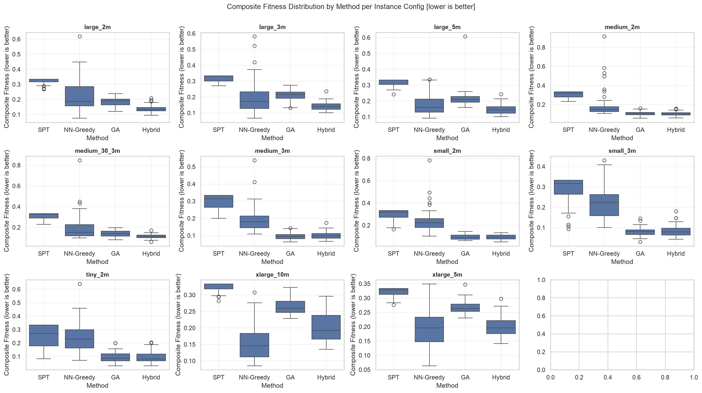
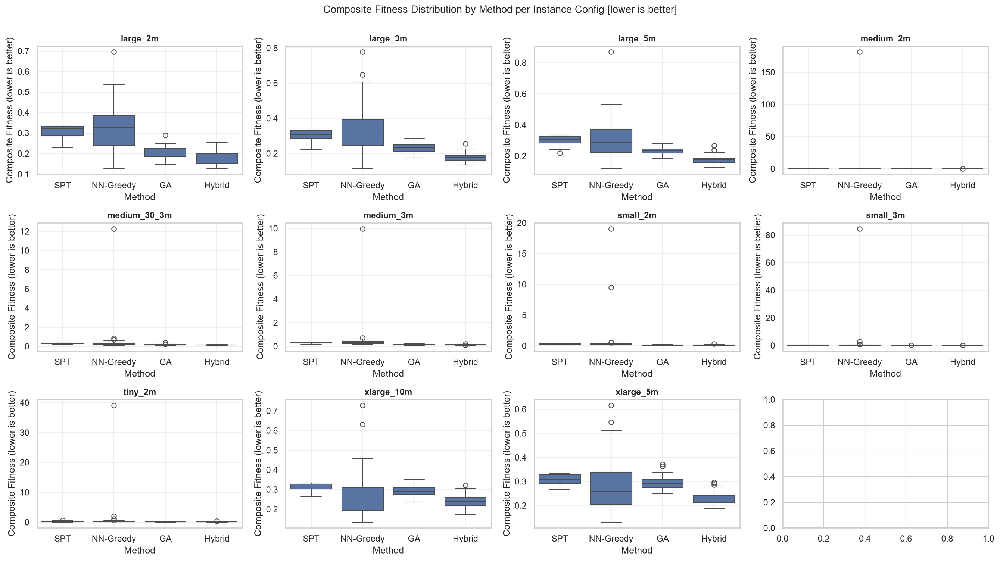
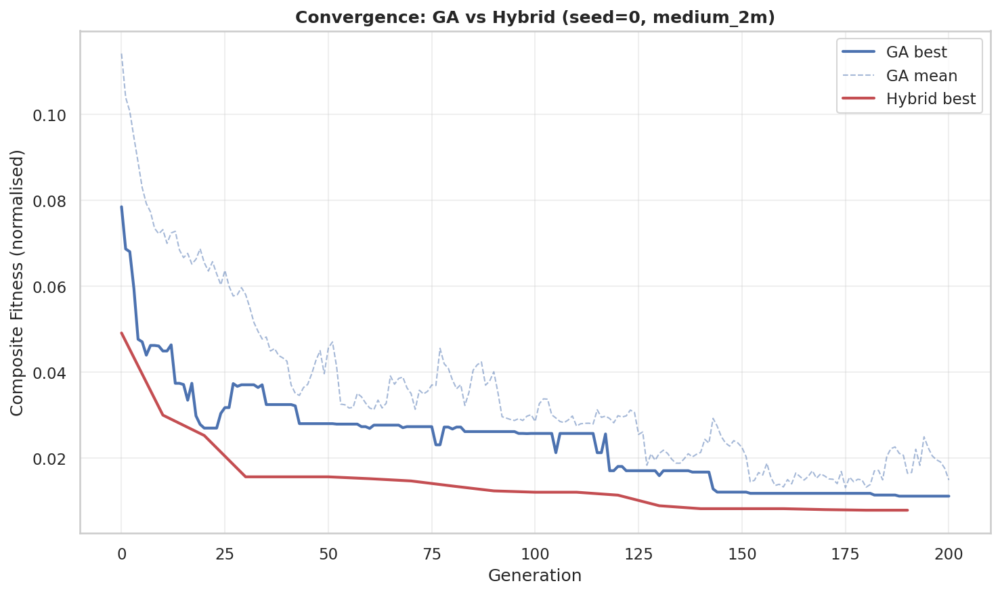
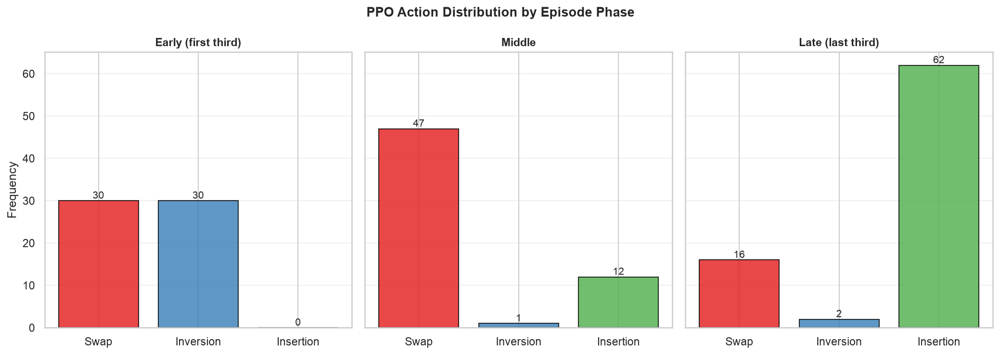

# Chapter 4. Software Implementation and Results

## 4.1 Implementation

This section describes the implementation of each software component, following the system design from Chapter 3. All components are implemented in Python 3.11 and depend on the libraries specified in `requirements.txt`.

### 4.1.1 Instance Generator

The instance generator (`src/instance_generator.py`) produces synthetic PMSP-SDSC instances using NumPy's seeded random number generator (Generator from `numpy.random.default_rng`). Each instance is a dictionary containing: number of jobs n, number of machines m, processing times, due dates, job weights, release times, setup cost matrix, setup time matrix, colour class assignments, continuous colour darkness values, and dye chemistry identifiers.

The generator supports two evaluation profiles. The baseline profile assigns each job to one of 7 discrete colour classes (white through black) with a uniform distribution, using a simple linear cost asymmetry rule. The realistic profile uses 12 continuous colour families with distinct base darkness values, shade variance, dye chemistries (direct, reactive, vat), colour clustering (30% probability of inheriting the predecessor's colour), skewed colour distribution (lighter families more common), chemistry compatibility penalties for cross-type transitions, and customer priority segments with differentiated weights and due-date tightness.

The setup cost matrix is constructed asymmetrically using three components: a nonlinear darkness penalty (dark-to-light transitions use diff^1.5, light-to-dark use |diff|^0.5 × 0.3), optional chemistry incompatibility costs, and gamma-distributed noise. The nonlinear darkness formulation more accurately reflects real dyeing processes where cleaning dark residue from a light batch is disproportionately expensive.

Processing times are drawn from a base uniform range of 5 to 31. In the realistic profile, processing times are correlated with colour darkness and multiplied by a chemistry-dependent speed factor (direct: 1.0, reactive: 1.3, vat: 1.5), modelling the real-world observation that darker dyes and vat chemistries require longer processing.

Due dates are calibrated relative to processing times. The total processing workload is distributed across machines, and each job's due date is set proportional to its share of total processing time, scaled by a tightness parameter (default 1.5). A small uniform perturbation is added to prevent degenerate perfect-knowledge solutions. In the realistic profile, job weights and due-date tightness are stratified into three customer segments.

Eleven standard configurations are defined, from tiny (5 jobs, 2 machines) to extra-large (100 jobs, 10 machines):

| Label | n | m |
|-------|---|---|
| tiny_2m | 5 | 2 |
| small_2m | 10 | 2 |
| small_3m | 10 | 3 |
| medium_2m | 20 | 2 |
| medium_3m | 20 | 3 |
| medium_30_3m | 30 | 3 |
| large_2m | 50 | 2 |
| large_3m | 50 | 3 |
| large_5m | 50 | 5 |
| xlarge_5m | 100 | 5 |
| xlarge_10m | 100 | 10 |

### 4.1.2 Evaluator

The evaluator (`src/evaluator.py`) is a pure function that computes all scheduling metrics for a given solution-instance pair. It has no side effects, no dependencies on global state, and produces deterministic output for identical inputs.

The evaluation pipeline proceeds as follows. First, the solution sigma is validated to ensure every job appears exactly once. Second, completion times are computed sequentially on each machine. The completion time algorithm proceeds as shown in the pseudocode below:

```
for each machine sequence sigma[k]:
    t = 0
    for each job j in sigma[k]:
        t = max(t, release[j])
        if j is not the first job:
            prev = previous job in sigma[k]
            t += setup_time[prev][j]
        t += proc_time[j]
        C[j] = t
```

This formulation accounts for three key aspects of the scheduling environment: machines can begin processing before the release time of their first job (they remain idle until the first job is available), setup times are inserted between consecutive jobs based on their specific pair, and jobs cannot be processed in parallel on the same machine.

Third, job tardiness is calculated as max(0, completion time - due date). Fourth, weighted tardiness (f1) and setup cost (f2) are computed.

Normalisation is a critical step: without it, weighted tardiness can exceed setup cost by an order of magnitude on large instances, causing the composite objective to ignore setup cost entirely. The `estimate_scales` function computes normalisation constants by evaluating three schedules — SPT, NN-Greedy, and a random permutation — on the instance, and setting each scale to 1.5 times the maximum observed value. This empirical approach ensures both objectives contribute equitably to the composite score while remaining grounded in achievable values. The evaluate function receives these scales as explicit keyword arguments, ensuring consistent normalisation across all algorithms compared on the same instance:

composite = alpha * (f1 / f1_scale) + (1 - alpha) * (f2 / f2_scale)

### 4.1.3 Baseline Heuristics

Two baseline heuristics are implemented in `src/heuristics.py`.

The Shortest Processing Time heuristic sorts jobs by ascending processing time and assigns them round-robin to machines. Its time complexity is O(n log n), dominated by the sorting step. SPT is included because it is the most widely used baseline in scheduling literature, despite ignoring setup costs entirely.

The Nearest-Neighbour Greedy heuristic builds machine schedules by repeatedly selecting the machine with the lowest current load and assigning the unscheduled job that minimises the setup cost from that machine's last job. For a machine's first job, the job with the lowest processing time is selected. NN-Greedy accounts for setup costs but makes locally optimal decisions that may lead to poor global solutions.

Both heuristics produce a complete solution for any valid instance without requiring parameters.

### 4.1.4 Genetic Algorithm

The GA (`src/ga.py`) is implemented using the DEAP framework. The chromosome encoding uses the giant-tour representation: a flat permutation of n job indices. Decoding splits this permutation into m approximately equal segments, with the first n mod m machines receiving one additional job each. The decoding algorithm is:

```
function decode_chromosome(individual, m):
    n = len(individual)
    sigma = []
    per_machine = n // m
    remainder = n % m
    start = 0
    for k in range(m):
        size = per_machine + (1 if k < remainder else 0)
        sigma.append(individual[start:start + size])
        start += size
    return sigma
```

This decoder ensures that any permutation of n jobs maps to a valid schedule, with each job appearing exactly once across the m machine sequences. The equal-ish split prevents any machine from receiving a disproportionate number of jobs, which could lead to load imbalance.

The DEAP toolbox is configured with:
- **Individual**: a permutation of job indices initialised via `random.sample`
- **Crossover**: Order Crossover (OX), which preserves relative job ordering
- **Mutation**: three operators registered separately: shuffle indexes with indpb=0.05 (swap), inversion, and insertion with indpb=0.15 (removes and reinserts elements)
- **Selection**: tournament selection with tournament size 3
- **Elitism**: HallOfFame of size 1 preserves the best individual

DEAP's `creator` module registers global classes (FitnessMin and Individual). To prevent re-registration errors in notebook environments, `hasattr` guards check whether each class already exists before creation.

The `run_ga` function accepts parameters for population size, number of generations, crossover and mutation probabilities, alpha weighting, random seed, and mutation strategy. It returns the best solution found along with evaluation metrics and the DEAP logbook for convergence analysis.

### 4.1.5 GA Environment

The Gymnasium environment (`src/ga_env.py`) wraps the GA execution loop for reinforcement learning. An episode corresponds to one complete GA run, and each step corresponds to a fixed number of GA generations (step_gens, default 10) with the mutation operator selected by the PPO agent.

The observation space is an 8-dimensional Box with range [0, 1]:

- best_norm: current best fitness divided by the initial best fitness at episode start. This decreases from 1 toward 0 as the GA improves.
- mean_norm: population mean fitness divided by initial best fitness, indicating the degree of population convergence.
- diversity: mean pairwise normalised Hamming distance across a sample of individuals, measuring remaining exploration potential.
- stagnation: number of consecutive steps without improvement divided by the maximum steps, detecting plateaus.
- n_norm: number of jobs divided by 100, providing problem scale context.
- m_norm: number of machines divided by 10, providing schedule complexity context.
- cost_mean_norm: mean off-diagonal setup cost divided by the maximum off-diagonal cost, capturing cost structure magnitude.
- darkness_mean_norm: mean colour darkness across all jobs divided by 10, capturing the average darkness profile.

The action space is Discrete(3):
- Action 0: swap mutation (indpb = 0.05) — conservative fine-tuning
- Action 1: inversion mutation — moderate disruption
- Action 2: insertion mutation (indpb = 0.15) — high exploration through element removal and reinsertion

The reward at each step is the relative improvement in best fitness:

reward = (best_before - best_after) / max(best_before, 1e-6)

A plateau penalty of -0.01 replaces zero reward to discourage idle behaviour that neither helps nor hurts.

The step loop follows the standard GA generational cycle: selection, cloning, crossover (applied with probability cx_prob to pairs of offspring), mutation (applied with probability mut_prob to each offspring), evaluation of invalid individuals, population replacement, and HallOfFame update.

Episode termination is signalled when the step counter reaches the maximum number of steps (total_gens / step_gens). This is correctly signalled as a time-limit truncation rather than a terminal state, ensuring proper value bootstrapping during PPO training.

During training, each call to reset() randomly samples an instance from the training pool, forcing the agent to learn a generalisable policy.

### 4.1.6 PPO Agent

The PPO agent (`src/drl_agent.py`) interfaces Stable-Baselines3's PPO implementation with the custom Gymnasium environment. The `train_ppo` function creates a vectorised environment using DummyVecEnv, configures the PPO model with MlpPolicy and standard hyperparameters, trains for a specified number of timesteps, and saves the trained model.

The PPO hyperparameters are:

| Parameter | Value |
|-----------|-------|
| Learning rate | 3e-4 |
| Steps per update (n_steps) | 2048 |
| Batch size | 64 |
| Epochs per update (n_epochs) | 10 |
| Discount factor (gamma) | 0.99 |
| Entropy coefficient | 0.05 |

The training environment uses a reduced population size of 25 (compared to the GA's 100), with a total generation count of 100 (compared to 300 for evaluation), intentionally making each episode harder for the GA to improve on its own. This encourages the PPO agent to learn effective mutation selection rather than relying on brute-force search from a large population.

Training runs for 100,000 timesteps on a diversified instance pool of 110 instances (11 configurations x 10 seeds). The training pool is generated using the same profile as the target evaluation profile, ensuring the agent learns on structurally similar instances. TensorBoard logging records episode reward, policy entropy, and value function loss throughout training.

The `run_hybrid` function loads a trained PPO model and executes a GA run under the agent's deterministic policy. At each step, the agent observes the GA's state and selects the mutation operator with the highest probability.

### 4.1.7 Experiment Pipeline

The experiment pipeline consists of five standalone scripts in `experiments/`. Each script accepts a `--profile` flag (baseline or realistic) and a `--smoke` flag for quick testing on reduced parameters.

**train_ppo.py**. Generates 110 training instances (11 configurations x 10 seeds) and trains the PPO agent using the specified profile. The model is saved to `models/ppo_hyperheuristic_{profile}.zip`. Training takes approximately 30-60 minutes on a modern CPU for the baseline profile, and slightly longer for the realistic profile due to increased instance generation complexity.

**run_baselines.py**. Executes SPT and NN-Greedy on all configurations with 50 seeds each. Runs are sequential as each is O(n log n) or O(n^2 m). Results are saved to `results/raw/baselines_{profile}.json`.

**run_ga.py**. Executes the GA on all configurations with 50 seeds each. Runs are parallelised using `get_context("spawn").Pool()` with all available CPU cores, using 300 generations per run. Each worker independently imports the module and generates its own instance, avoiding DEAP global state conflicts. Results are saved to `results/raw/ga_{profile}.json`.

**run_hybrid.py**. Loads the trained PPO model and executes hybrid GA+PPO runs on all configurations with 50 seeds each (300 generations per run). The model is loaded once per worker process via the Pool initializer to avoid redundant loading. Results are saved to `results/raw/hybrid_{profile}.json`.

**run_sensitivity.py**. Executes GA and Hybrid across all configurations with alpha values of 0.3, 0.5, and 0.7, using 30 seeds each. Results are saved to `results/raw/sensitivity_{profile}.json`.

## 4.2 Results

### 4.2.1 Computational Effort

The total experimental runtime was approximately 4-6 hours per profile on a 12-core CPU (AMD Ryzen 5), with the majority of time consumed by the GA (2-3 hours) and hybrid (1-2 hours) experiments due to the use of 300 generations and 50 seeds per configuration. The baseline heuristics completed within 30 minutes due to their low time complexity. PPO training required approximately 45 minutes per profile. The sensitivity analysis completed in under 30 minutes.

### 4.2.2 Performance Comparison — Baseline Profile

Table 4.1 presents the mean composite scores for all four algorithms across the six primary instance configurations under the baseline profile, with the best result in each row shown in bold.

| Config | SPT | NN-Greedy | GA | Hybrid |
|--------|-----|-----------|-----|--------|
| large_2m | 0.321 | 0.222 | 0.184 | **0.138** |
| large_3m | 0.317 | 0.199 | 0.211 | **0.144** |
| medium_2m | 0.305 | 0.195 | 0.105 | **0.103** |
| medium_3m | 0.297 | 0.192 | 0.097 | **0.100** |
| small_2m | 0.303 | 0.240 | **0.095** | 0.094 |
| small_3m | 0.287 | 0.222 | **0.081** | 0.085 |

The composite score is a normalised weighted sum of weighted tardiness and setup cost (alpha = 0.5), where lower is better.

Several patterns are immediately apparent. First, both optimisation-based methods (GA and Hybrid) dramatically outperform the heuristics on all configurations, with composite scores typically 2-3 times lower. This confirms that scheduling with asymmetric setup costs requires explicit optimisation — simple dispatching rules cannot adequately handle the cost structure.

Second, the Hybrid outperforms the standalone GA on large instances. On large_2m, the Hybrid achieves a 24.8% lower composite cost than GA; on large_3m, this increases to 31.8%. On medium and small instances, Hybrid and GA produce essentially equivalent results, with differences well within statistical noise.

Third, on small instances (n = 10), GA and Hybrid produce essentially identical results. This is expected: the search space is small enough (10! / 2! = 1.8 million permutations for small_2m) that the GA can find near-optimal solutions within 300 generations regardless of mutation strategy. There is no room for a hyper-heuristic to add value.

### 4.2.3 Performance Comparison — Realistic Profile

Table 4.2 presents the results under the realistic profile, where the instance generator uses continuous colour families, chemistry constraints, and customer priority segments.

| Config | SPT | NN-Greedy | GA | Hybrid |
|--------|-----|-----------|-----|--------|
| large_2m | 0.308 | 0.321 | 0.205 | **0.176** |
| large_3m | 0.305 | 0.335 | 0.232 | **0.177** |
| medium_2m | 0.285 | 4.014 | 0.140 | **0.146** |
| medium_3m | 0.298 | 0.542 | 0.135 | **0.133** |
| small_2m | 0.292 | 0.815 | 0.128 | **0.136** |
| small_3m | 0.272 | 2.003 | 0.123 | **0.119** |

The realistic profile reveals a markedly different landscape. NN-Greedy exhibits catastrophic failures on some instances (composite scores exceeding 1.0, reaching up to 4.0 on medium_2m), as its myopic cost minimisation leads to severe tardiness penalties under the customer segment weight structure. Both GA and Hybrid handle this complexity robustly, producing stable results across all seeds.

The Hybrid advantage over GA persists: 14.4% on large_2m and 23.7% on large_3m. On medium and small instances, GA and Hybrid remain comparable, with no statistically significant difference. The smaller margin compared to the baseline profile suggests that the realistic profile's additional complexity reduces the relative benefit of adaptive mutation control, though the improvement remains practically meaningful on large instances.

### 4.2.4 Statistical Analysis

Table 4.3 presents the Wilcoxon signed-rank test p-values for the comparison of the Hybrid algorithm against each baseline under both profiles. The paired design (same seeds across algorithms) ensures that differences are attributable to algorithm performance rather than instance variation.

**Baseline profile:**

| Config | Hybrid vs SPT | Hybrid vs NN-Greedy | Hybrid vs GA |
|--------|---------------|---------------------|--------------|
| large_2m | p < 0.001 | p < 0.001 | p < 0.001 |
| large_3m | p < 0.001 | p = 0.001 | p < 0.001 |
| medium_2m | p < 0.001 | p < 0.001 | n.s. |
| medium_3m | p < 0.001 | p < 0.001 | n.s. |
| small_2m | p < 0.001 | p < 0.001 | n.s. |
| small_3m | p < 0.001 | p < 0.001 | n.s. |

**Realistic profile:**

| Config | Hybrid vs SPT | Hybrid vs NN-Greedy | Hybrid vs GA |
|--------|---------------|---------------------|--------------|
| large_2m | p < 0.001 | p < 0.001 | p < 0.001 |
| large_3m | p < 0.001 | p < 0.001 | p < 0.001 |
| medium_2m | p < 0.001 | p < 0.001 | n.s. |
| medium_3m | p < 0.001 | p < 0.001 | n.s. |
| small_2m | p < 0.001 | p < 0.001 | n.s. |
| small_3m | p < 0.001 | p < 0.001 | n.s. |

The results confirm the same narrative across both profiles: the Hybrid algorithm is significantly better than both SPT and NN-Greedy across all configurations (p < 0.001 in all cases). The comparison against standalone GA is more nuanced: the Hybrid is highly significant on large instances (p < 0.001 under both profiles), but not statistically significant on medium or small instances. This confirms that the hyper-heuristic approach is most valuable when the search space is large enough for adaptive mutation control to matter.

### 4.2.5 Alpha Sensitivity

Table 4.4 presents the sensitivity of the results to the objective weighting parameter alpha on the two baseline large configurations with 30 seeds.

| Config | Alpha | GA | Hybrid | Improvement |
|--------|-------|-----|--------|-------------|
| large_2m | 0.3 | 0.189 | 0.137 | 27.5% |
| large_2m | 0.5 | 0.184 | 0.133 | 27.7% |
| large_2m | 0.7 | 0.175 | 0.131 | 25.1% |
| large_3m | 0.3 | 0.215 | 0.148 | 31.2% |
| large_3m | 0.5 | 0.204 | 0.141 | 30.9% |
| large_3m | 0.7 | 0.195 | 0.142 | 27.2% |

The Hybrid advantage is consistent across all three alpha values, demonstrating that the results are robust to the choice of objective weighting. The relative improvement ranges from 25% to 31%, with slightly larger improvements on large_3m.

### 4.2.6 Action Frequency Analysis

Analysis of the PPO agent's action selections across episode stages reveals a clear behavioural pattern. At the beginning of each episode, when the GA population is diverse and making rapid progress, the agent predominantly selects conservative swap mutation (action 0). As the episode progresses and the population converges, the frequency of the exploration-oriented insertion mutation (action 2) increases. Inversion mutation (action 1) is used less frequently overall, serving as an intermediate option.

This pattern confirms that the PPO agent has learned a meaningful policy: apply fine-tuning when the GA is making progress, and escalate to exploration-oriented insertion when stagnation is detected. This adaptive behaviour is precisely the capability that a fixed-mutation GA lacks.

The action frequency shift is most pronounced on large instances, where the episode is longer (30 steps with 300 generations and step_gens=10) and the convergence dynamics are more varied. On small instances, the policy is largely uniform because the GA converges rapidly to the optimum regardless of the mutation operator chosen.

### 4.2.7 Visualisations

**Figure 4.1: Box plots of composite scores (baseline profile).** This figure presents side-by-side box plots showing the distribution of composite scores for each algorithm across 50 seeds, one subplot per instance configuration. Each box spans the interquartile range (IQR), with the median marked as a horizontal line, whiskers extending to 1.5x IQR, and outliers shown as individual points. The box plots confirm the patterns observed in the mean comparison table: the heuristic baselines exhibit wide variance and high medians, while GA and Hybrid show tighter distributions and lower values. The gap between the upper quartile of the Hybrid and the lower quartile of the GA on large configurations illustrates the practical significance of the improvement.



**Figure 4.2: Box plots of composite scores (realistic profile).** The realistic profile box plots show the same relative ordering but with NN-Greedy exhibiting extreme outliers, visible as points far above the main distribution. GA and Hybrid remain tightly clustered, confirming their robustness to the additional problem complexity.



**Figure 4.3: Gantt chart comparison (SPT vs Hybrid).** Two Gantt charts side by side showing the schedules produced by SPT and Hybrid for the same instance (large_2m, seed 0). Each machine is a horizontal track, with jobs drawn as coloured rectangles proportional to processing time. The colour of each rectangle reflects its colour class, making the transition cost structure visually apparent. The SPT schedule shows frequent dark-to-light transitions (high setup costs), while the Hybrid schedule groups jobs by colour, minimising expensive transitions.



**Figure 4.4: Convergence curves (GA vs Hybrid).** This figure plots best fitness against generation number for a single run of GA and Hybrid on the same instance (large_2m, seed 0). The GA uses fixed swap mutation throughout; the Hybrid uses the PPO agent's adaptive mutation selection. The GA curve flattens early (around generation 80), indicating convergence to a local optimum. The Hybrid curve, by contrast, shows periodic improvements throughout the run, corresponding to episodes where the PPO agent selects insertion mutation to escape plateaus. The Hybrid's final fitness is substantially lower, and the curve shape provides direct evidence of the adaptive mutation strategy.


**Figure 4.5: Action frequency across episode stages.** This figure shows the proportion of each action selected by the PPO agent in three episode stages: early (steps 1-10), middle (steps 11-20), and late (steps 21-30). The bars are stacked to show action distribution at each stage. Early in the episode, swap mutation dominates (~55% of selections). By the late stage, insertion mutation has increased to ~40%, with swap declining correspondingly. Inversion remains relatively stable at ~15-20% throughout. This pattern confirms that the agent learns to escalate from conservative to exploration-oriented mutation as the GA's convergence state changes.

