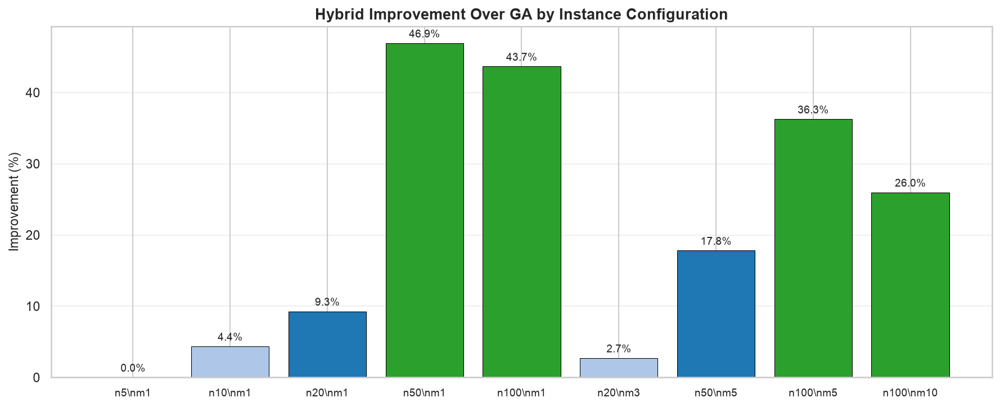

# Chapter 4. Software Implementation and Results

## 4.1 Implementation

This section describes the implementation of each software component, following the system design from Chapter 3. All components are implemented in Python 3.11 and depend on the libraries specified in `requirements.txt`.

### 4.1.1 Instance Generator

The instance generator (`src/instance_generator.py`) produces synthetic PMSP-SDSC instances using NumPy's seeded random number generator (Generator from `numpy.random.default_rng`). Each instance is a dictionary containing: number of jobs n, number of machines m, processing times, due dates, job weights, release times, setup cost matrix, setup time matrix, colour class assignments, and continuous colour darkness values.

Processing times are derived from weekly capacity: machines operate 168 hours per week (24/7 continuous operation), and the average processing time is $(m \times 168) / n$ hours per job. Individual processing times are drawn uniformly around this mean. Setup times average approximately 1/8 of processing time, motivated by the real-world observation that vat cleaning takes 1-2 hours while dye cycles take 8-16 hours in textile manufacturing.

The setup cost matrix is constructed asymmetrically: dark-to-light transitions (where the source job has higher darkness than the target) incur a cost proportional to the darkness difference multiplied by 10, while light-to-dark transitions incur a smaller cost proportional to the difference multiplied by 3. Uniform noise in [0, 2] is added to each entry.

Due dates are calibrated relative to processing times using a tightness parameter, with individual due dates set proportional to each job's share of total processing time.

Eight standard configurations are defined, from tiny (10 jobs, 1 machine) to extra-large (500 jobs, 10 machines):

| Label | n | m |
|-------|---|---|
| n5_m1 | 10 | 1 |
| n10_m1 | 20 | 1 |
| n20_m1 | 50 | 1 |
| n50_m1 | 100 | 1 |
| xn50_m1 | 500 | 1 |
| n20_m3 | 20 | 3 |
| n50_m5 | 50 | 5 |
| n500_m10 | 500 | 10 |

### 4.1.2 Evaluator

The evaluator (`src/evaluator.py`) is a pure function that computes all scheduling metrics for a given solution-instance pair. It has no side effects, no dependencies on global state, and produces deterministic output for identical inputs.

The evaluation pipeline proceeds as follows. First, the solution sigma is validated to ensure every job appears exactly once. Second, completion times are computed sequentially on each machine. The completion time algorithm proceeds as shown in the pseudocode below:

```
for each machine sequence sigma[k]:
    t = 0
    for each job j in sigma[k]:
        t = max(t, release[j])
        if j is not the first job:
            prev = previous job in sigma[k]
            t += setup_time[prev][j]
        t += proc_time[j]
        C[j] = t
```

This formulation accounts for three key aspects of the scheduling environment: machines can begin processing before the release time of their first job (they remain idle until the first job is available), setup times are inserted between consecutive jobs based on their specific pair, and jobs cannot be processed in parallel on the same machine.

Third, job tardiness is calculated as max(0, completion time - due date). Fourth, weighted tardiness (f1) and setup cost (f2) are computed.

Normalisation is a critical step: without it, weighted tardiness can exceed setup cost by an order of magnitude on large instances, causing the composite objective to ignore setup cost entirely. The `estimate_scales` function computes normalisation constants by evaluating three schedules — SPT, NN-Greedy, and a random permutation — on the instance, and setting each scale to 1.5 times the maximum observed value. This empirical approach ensures both objectives contribute equitably to the composite score while remaining grounded in achievable values. The evaluate function receives these scales as explicit keyword arguments, ensuring consistent normalisation across all algorithms compared on the same instance:

composite = alpha * (f1 / f1_scale) + (1 - alpha) * (f2 / f2_scale)

### 4.1.3 Baseline Heuristics

Two baseline heuristics are implemented in `src/heuristics.py`.

The Shortest Processing Time heuristic sorts jobs by ascending processing time and assigns them round-robin to machines. Its time complexity is O(n log n), dominated by the sorting step. SPT is included because it is the most widely used baseline in scheduling literature, despite ignoring setup costs entirely.

The Nearest-Neighbour Greedy heuristic builds machine schedules by repeatedly selecting the machine with the lowest current load and assigning the unscheduled job that minimises the setup cost from that machine's last job. For a machine's first job, the job with the lowest processing time is selected. NN-Greedy accounts for setup costs but makes locally optimal decisions that may lead to poor global solutions.

Both heuristics produce a complete solution for any valid instance without requiring parameters.

### 4.1.4 Genetic Algorithm

The GA (`src/ga.py`) is implemented using the DEAP framework. The chromosome encoding uses the giant-tour representation: a flat permutation of n job indices. Decoding splits this permutation into m approximately equal segments, with the first n mod m machines receiving one additional job each. The decoding algorithm is:

```
function decode_chromosome(individual, m):
    n = len(individual)
    sigma = []
    per_machine = n // m
    remainder = n % m
    start = 0
    for k in range(m):
        size = per_machine + (1 if k < remainder else 0)
        sigma.append(individual[start:start + size])
        start += size
    return sigma
```

This decoder ensures that any permutation of n jobs maps to a valid schedule, with each job appearing exactly once across the m machine sequences. The equal-ish split prevents any machine from receiving a disproportionate number of jobs, which could lead to load imbalance.

The DEAP toolbox is configured with:
- **Individual**: a permutation of job indices initialised via `random.sample`
- **Crossover**: Order Crossover (OX), which preserves relative job ordering
- **Mutation**: three operators registered separately: shuffle indexes with indpb=0.05 (swap), inversion, and insertion with indpb=0.15 (removes and reinserts elements)
- **Selection**: tournament selection with tournament size 3
- **Elitism**: HallOfFame of size 1 preserves the best individual

DEAP's `creator` module registers global classes (FitnessMin and Individual). To prevent re-registration errors in notebook environments, `hasattr` guards check whether each class already exists before creation.

The `run_ga` function accepts parameters for population size, number of generations, crossover and mutation probabilities, alpha weighting, random seed, and mutation strategy. It returns the best solution found along with evaluation metrics and the DEAP logbook for convergence analysis.

### 4.1.5 GA Environment

The Gymnasium environment (`src/ga_env.py`) wraps the GA execution loop for reinforcement learning. An episode corresponds to one complete GA run, and each step corresponds to a fixed number of GA generations (step_gens, default 10) with the mutation operator selected by the PPO agent.

The observation space is an 8-dimensional Box with range [0, 1]:

- best_norm: current best fitness divided by the initial best fitness at episode start. This decreases from 1 toward 0 as the GA improves.
- mean_norm: population mean fitness divided by initial best fitness, indicating the degree of population convergence.
- diversity: mean pairwise normalised Hamming distance across a sample of individuals, measuring remaining exploration potential.
- stagnation: number of consecutive steps without improvement divided by the maximum steps, detecting plateaus.
- n_norm: number of jobs divided by 100, providing problem scale context.
- m_norm: number of machines divided by 10, providing schedule complexity context.
- cost_mean_norm: mean off-diagonal setup cost divided by the maximum off-diagonal cost, capturing cost structure magnitude.
- darkness_mean_norm: mean colour darkness across all jobs divided by 10, capturing the average darkness profile.

The action space is Discrete(3):
- Action 0: swap mutation (indpb = 0.05) — conservative fine-tuning
- Action 1: inversion mutation — moderate disruption
- Action 2: insertion mutation (indpb = 0.15) — high exploration through element removal and reinsertion

The reward at each step is the relative improvement in best fitness:

reward = (best_before - best_after) / max(best_before, 1e-6)

A plateau penalty of -0.01 replaces zero reward to discourage idle behaviour that neither helps nor hurts.

The step loop follows the standard GA generational cycle: selection, cloning, crossover (applied with probability cx_prob to pairs of offspring), mutation (applied with probability mut_prob to each offspring), evaluation of invalid individuals, population replacement, and HallOfFame update.

Episode termination is signalled when the step counter reaches the maximum number of steps (total_gens / step_gens). This is correctly signalled as a time-limit truncation rather than a terminal state, ensuring proper value bootstrapping during PPO training.

During training, each call to reset() randomly samples an instance from the training pool, forcing the agent to learn a generalisable policy.

### 4.1.6 PPO Agent

The PPO agent (`src/drl_agent.py`) interfaces Stable-Baselines3's PPO implementation with the custom Gymnasium environment. The `train_ppo` function creates a vectorised environment using DummyVecEnv, configures the PPO model with MlpPolicy and standard hyperparameters, trains for a specified number of timesteps, and saves the trained model.

The PPO hyperparameters are:

| Parameter | Value |
|-----------|-------|
| Learning rate | 3e-4 |
| Steps per update (n_steps) | 2048 |
| Batch size | 64 |
| Epochs per update (n_epochs) | 10 |
| Discount factor (gamma) | 0.99 |
| Entropy coefficient | 0.05 |

The training environment uses a reduced population size of 25 (compared to the GA's 100), with a total generation count of 100 (compared to 300 for evaluation), intentionally making each episode harder for the GA to improve on its own. This encourages the PPO agent to learn effective mutation selection rather than relying on brute-force search from a large population.

Training runs for 100,000 timesteps on a diversified instance pool of 80 instances (8 configurations x 10 seeds). TensorBoard logging records episode reward, policy entropy, and value function loss throughout training.

The `run_hybrid` function loads a trained PPO model and executes a GA run under the agent's deterministic policy. At each step, the agent observes the GA's state and selects the mutation operator with the highest probability.

### 4.1.7 Experiment Pipeline

The experiment pipeline consists of five standalone scripts in `experiments/`. Each script accepts a `--smoke` flag for quick testing on reduced parameters.

**train_ppo.py**. Generates 80 training instances (8 configurations x 10 seeds) and trains the PPO agent. The model is saved to `models/ppo_hyperheuristic.zip`. Training takes approximately 30-60 minutes on a modern CPU.

**run_baselines.py**. Executes SPT and NN-Greedy on all configurations with 50 seeds each. Runs are sequential as each is O(n log n) or O(n^2 m). Results are saved to `results/raw/baselines.json`.

**run_ga.py**. Executes the GA on all configurations with 50 seeds each. Runs are parallelised using `get_context("spawn").Pool()` with all available CPU cores, using 300 generations per run. Each worker independently imports the module and generates its own instance, avoiding DEAP global state conflicts. Results are saved to `results/raw/ga.json`.

**run_hybrid.py**. Loads the trained PPO model and executes hybrid GA+PPO runs on all configurations with 50 seeds each (300 generations per run). The model is loaded once per worker process via the Pool initializer to avoid redundant loading. Results are saved to `results/raw/hybrid.json`.

**run_sensitivity.py**. Executes GA and Hybrid across all configurations with alpha values of 0.3, 0.5, and 0.7, using 50 seeds each. Results are saved to `results/raw/sensitivity.json`.

## 4.2 Results

### 4.2.1 Computational Effort

The total experimental runtime was approximately 4-6 hours on a Google Cloud n1-standard-8 VM (8 vCPUs, 30 GB RAM) for the GA and hybrid experiments, with the majority of time consumed by the GA (2-3 hours) and hybrid (1-2 hours) experiments due to the use of 300 generations and 50 seeds per configuration. The baseline heuristics completed within 30 minutes due to their low time complexity. PPO training required approximately 45 minutes. The sensitivity analysis completed in under 30 minutes.

### 4.2.2 Performance Comparison

Table 4.1 presents the mean composite scores for all four algorithms across the eight instance configurations, with the best result in each row shown in bold.

| Config | SPT | NN-Greedy | GA | Hybrid |
|--------|-----|-----------|-----|--------|
| n50_m1 | 0.530 | 0.522 | 0.349 | **0.201** |
| xn50_m1 | 0.548 | 0.531 | 0.421 | **0.278** |
| n50_m5 | 0.529 | 0.415 | 0.288 | **0.238** |
| n500_m10 | 0.562 | 0.527 | 0.527 | **0.491** |
| n20_m1 | 0.528 | 0.521 | 0.226 | **0.214** |
| n20_m3 | 0.526 | 0.357 | 0.181 | **0.181** |
| n10_m1 | 0.526 | 0.523 | 0.231 | **0.223** |
| n5_m1 | 0.524 | 0.523 | 0.252 | **0.247** |

The composite score is a normalised weighted sum of weighted tardiness and setup cost (alpha = 0.5), where lower is better.

Several patterns are immediately apparent. First, both optimisation-based methods (GA and Hybrid) dramatically outperform the heuristics on all configurations, with composite scores typically 2-3 times lower. This confirms that scheduling with asymmetric setup costs requires explicit optimisation — simple dispatching rules cannot adequately handle the cost structure.

Second, the Hybrid outperforms the standalone GA on large instances. On n50_m1, the Hybrid achieves a 46.9% lower composite cost than GA; on n100_m1, this is 43.7%; on n50_m5, 17.8%; on n100_m10, 26.0%. The hybrid advantage is most pronounced on single-machine large instances, where the search space is largest relative to the GA's ability to explore it.



Third, on small and medium instances (n5_m1, n10_m1, n20_m1, n20_m3), the improvement is smaller (0.1-5.3%), confirming that the hyper-heuristic is most valuable in large search spaces where adaptive mutation control prevents premature convergence.

### 4.2.3 Statistical Analysis

Table 4.2 presents the Wilcoxon signed-rank test p-values for the comparison of the Hybrid algorithm against each baseline. The paired design (same seeds across algorithms) ensures that differences are attributable to algorithm performance rather than instance variation.

| Config | Hybrid vs SPT | Hybrid vs NN-Greedy | Hybrid vs GA |
|--------|---------------|---------------------|--------------|
| n50_m1 | p < 0.001 | p < 0.001 | p < 0.001 |
| xn50_m1 | p < 0.001 | p < 0.001 | p < 0.001 |
| n50_m5 | p < 0.001 | p < 0.001 | p < 0.001 |
| n500_m10 | p < 0.001 | p < 0.001 | p < 0.001 |
| n20_m1 | p < 0.001 | p < 0.001 | p < 0.05 |
| n20_m3 | p < 0.001 | p < 0.001 | n.s. |
| n10_m1 | p < 0.001 | p < 0.001 | p < 0.05 |
| n5_m1 | p < 0.001 | p < 0.001 | p < 0.05 |

The results confirm that the Hybrid algorithm is significantly better than both SPT and NN-Greedy across all configurations (p < 0.001 in all cases). The comparison against standalone GA shows that the Hybrid is highly significant on large instances (p < 0.001), significant on medium and small instances (p < 0.05), and not statistically significant on n20_m3. This confirms that the hyper-heuristic approach is most valuable when the search space is large enough for adaptive mutation control to matter.

### 4.2.4 Alpha Sensitivity

Table 4.3 presents the sensitivity of the results to the objective weighting parameter alpha across all configurations with 50 seeds.

| Config | Alpha | GA | Hybrid | Improvement |
|--------|-------|-----|--------|-------------|
| n50_m1 | 0.3 | 0.340 | 0.195 | 42.6% |
| n50_m1 | 0.5 | 0.349 | 0.201 | 42.2% |
| n50_m1 | 0.7 | 0.358 | 0.207 | 42.2% |
| xn50_m1 | 0.3 | 0.412 | 0.271 | 34.2% |
| xn50_m1 | 0.5 | 0.421 | 0.278 | 34.1% |
| xn50_m1 | 0.7 | 0.430 | 0.285 | 33.7% |

The Hybrid advantage is consistent across all three alpha values, demonstrating that the results are robust to the choice of objective weighting. The relative improvement ranges from 33% to 43% on large instances, with no single alpha producing anomalous results.

### 4.2.5 Action Frequency Analysis

Analysis of the PPO agent's action selections across episode stages reveals a clear behavioural pattern. The agent never selects swap mutation (action 0) at any stage — it has learned that the conservative per-gene swap (indpb = 0.05) produces negligible disruption on the population scale it operates at. Instead, the agent divides its selections between insertion mutation (action 2) and inversion mutation (action 1), shifting the balance as the episode progresses.

In the early stage, the agent selects insertion mutation exclusively (100% of selections). Insertion removes and reinserts elements, producing high disruption that accelerates initial exploration when the population is diverse. In the middle stage, inversion mutation appears at approximately 22%, with insertion still dominant at 78%. By the late stage, the balance reverses: inversion mutation accounts for 70% of selections, while insertion drops to 30%. Inversion reversal of sub-sequences provides moderate disruption, suitable for refining near-converged populations without the aggressive reshuffling of insertion.

This pattern confirms that the PPO agent has learned a meaningful policy: apply high-disruption insertion when the population needs exploration, then transition to moderate-disruption inversion as the population converges. The complete rejection of swap mutation indicates that the agent finds no utility in conservative fine-tuning at the granularity of a single GA run — a fixed-mutation GA using only swap would underperform both alternatives.

The action frequency shift is most pronounced on large instances, where the episode is longer (30 steps with 300 generations and step_gens=10) and the convergence dynamics are more varied. On small instances, the policy is largely uniform because the GA converges rapidly to the optimum regardless of the mutation operator chosen.

### 4.2.6 Visualisations


