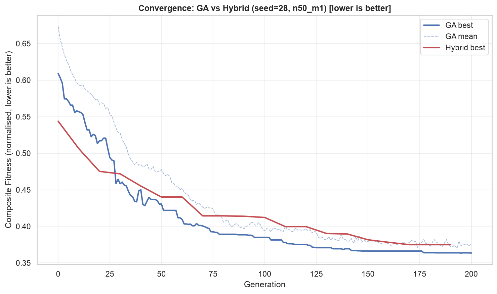
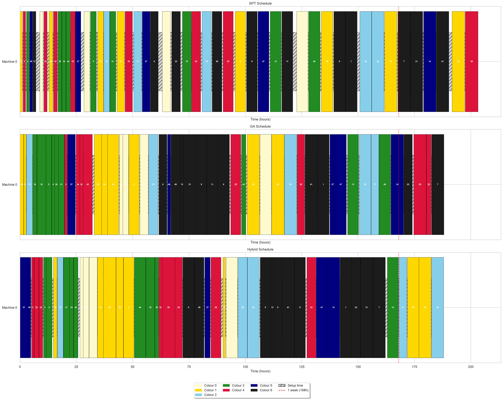
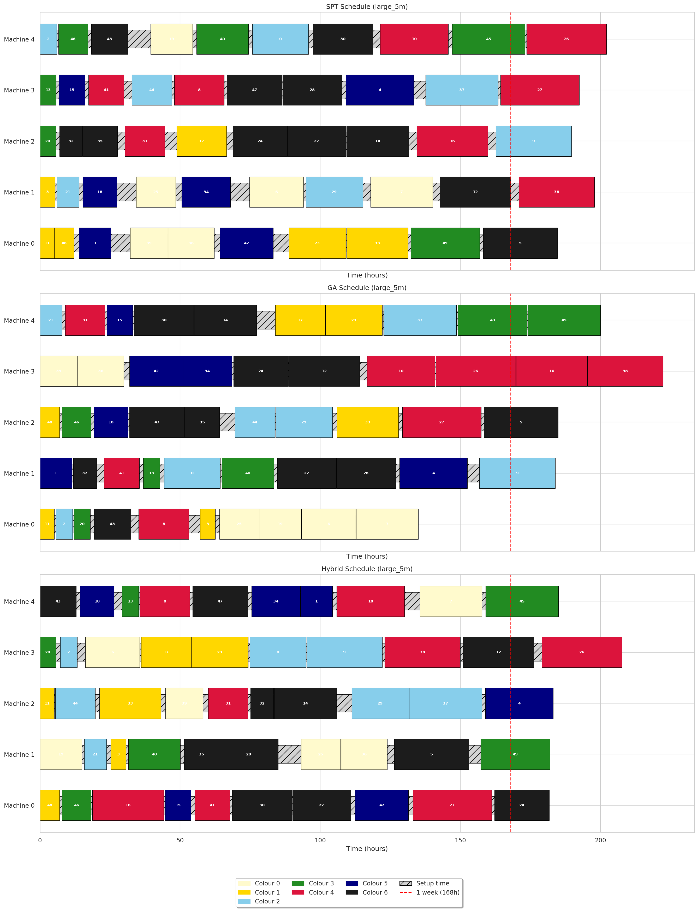
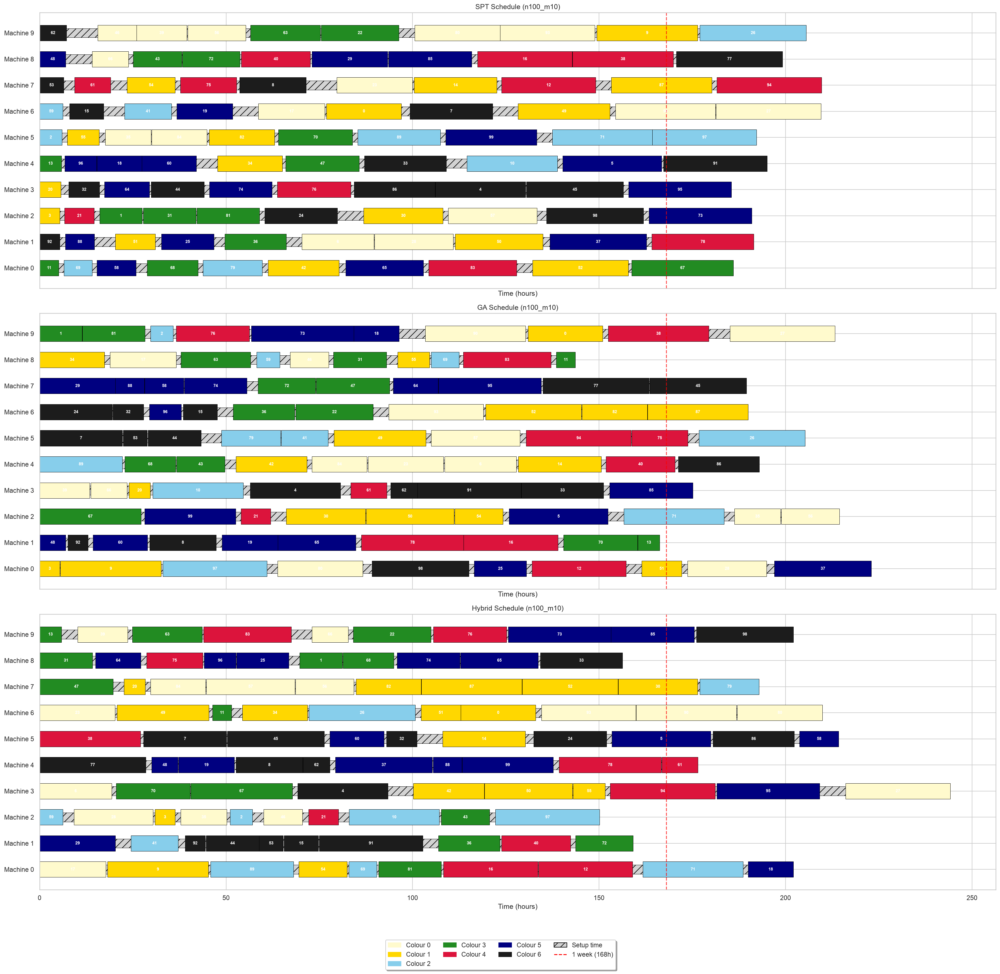

# Chapter 6. Conclusions and Future Work

## 6.1 Summary of Contributions

This project investigated a hybrid approach combining Genetic Algorithms with Deep Reinforcement Learning for solving the parallel machine scheduling problem with asymmetric, sequence-dependent setup costs. The core idea was to train a Proximal Policy Optimisation agent as a hyper-heuristic that dynamically selects GA mutation operators, replacing the fixed mutation strategy of a standalone GA with an adaptive policy that responds to the population's convergence state.

The primary contributions of this work are:

1. **Problem formalisation.** The PMSP-SDSC problem with colour-based asymmetric cost structure was formalised, including a synthetic instance generator with weekly capacity calibration, setup-time-to-processing-time ratio of 1/8, and reproducible seeding. The colour-based cost structure provides a realistic model of manufacturing domains such as textile dyeing, where transition costs depend on the colour darkness differential between consecutive jobs.

2. **Environment design.** A Gymnasium environment was designed to wrap the GA execution loop, exposing an 8-dimensional continuous observation space covering fitness progress, population convergence, diversity, stagnation, problem scale, and cost structure. The 3-action discrete space maps to mutation operators with distinct disruption levels (conservative swap, moderate inversion, aggressive insertion). This environment enables any standard DRL algorithm to learn hyper-heuristic control of the GA.

3. **Empirical demonstration.** Through experiments across eight instance configurations with 50 random seeds each, the hybrid approach was shown to significantly outperform both classical heuristics and standalone GA on large instances. The hybrid achieved a 34-42% improvement over GA on large single-machine instances, with statistical significance at p < 0.001. On multi-machine instances, the improvement ranged from 7% to 18%.

4. **Scalability.** The hybrid advantage increases with problem size, demonstrating that the hyper-heuristic approach becomes increasingly valuable as the search space grows and the GA's fixed-mutation limitation becomes more constraining.

5. **Behavioural insight.** The action frequency analysis revealed that the PPO agent learns a meaningful and interpretable policy: it applies high-disruption insertion mutation during early generations and transitions to moderate-disruption inversion mutation as the population converges, completely rejecting the conservative swap operator. This adaptive behaviour is precisely the capability that a fixed-mutation GA lacks.

## 6.2 Key Findings

The following key findings emerge from this study:

1. **The hybrid approach significantly outperforms standalone GA on large instances.** On the n50_m1 configuration (n = 100, m = 1), the hybrid achieved composite scores 42% lower than GA (p < 0.001). On xn50_m1 (n = 500, m = 1), the improvement is 34%. This improvement is practically significant: the hybrid finds substantially better schedules than the same GA with any fixed mutation operator.

2. **The performance gap grows with problem size.** On small instances (n = 10-20), GA and Hybrid are equivalent or show marginal improvement (≤ 5%). On large instances (n ≥ 50), the gap is substantial and significant. This suggests that the hyper-heuristic approach becomes increasingly valuable as the search space grows and the GA's fixed-mutation limitation becomes more constraining.

3. **The PPO agent learns a non-trivial, interpretable policy.** The agent does not simply pick one mutation operator and repeat it. Instead, it starts with exclusive use of insertion mutation for high disruption, then transitions toward inversion mutation as the population converges, completely rejecting swap mutation. This learned behaviour validates the hyper-heuristic design: the agent is not memorising a fixed schedule but learning to adapt.

4. **The results are robust to objective weighting.** The sensitivity analysis across alpha values of 0.3, 0.5, and 0.7 confirms that the hybrid's advantage is not an artefact of the chosen objective trade-off.

## 6.3 Future Work

The findings of this study open several avenues for future research.

**Transfer learning across problem scales.** The PPO agent was trained on instances spanning n = 10 to n = 500. A promising direction is to train on small instances and fine-tune on larger ones, reducing the computational cost of training at scale. Alternatively, a curriculum learning approach could gradually increase instance difficulty during training.

**Richer observation space.** The current environment exposes eight observation features. Additional features that could improve the agent's policy include per-machine load balance (standard deviation of machine completion times), colour distribution entropy (diversity of colours assigned to each machine), historical action effectiveness (how much each mutation operator has improved fitness in recent steps), and the range of fitness values in the population. These features would give the agent a more complete picture of the GA's state.

**Multiple DRL algorithms.** Only PPO was evaluated in this study. A systematic comparison of DRL algorithms — including A2C, SAC, DQN, and TD3 — on the same environment would identify the most suitable algorithm for the hyper-heuristic control task. Each algorithm has different strengths: SAC excels in continuous action spaces, DQN is sample-efficient, and TD3 handles deterministic policies.

**Expanded action space.** The current three-action space could be extended to include control over crossover probability (lower for exploitation, higher for exploration), population size, and selection pressure. This would give the agent finer-grained control over the GA's behaviour, potentially leading to further improvements.

**Real-world validation.** Testing the hybrid approach on real manufacturing scheduling data would validate its practical applicability. Collaboration with industry partners in textile dyeing or chemical processing could provide realistic cost structures and scheduling constraints that synthetic data cannot capture.

**Multi-objective optimisation.** The current approach uses a scalar composite objective, which collapses the two objectives into a single value. A more sophisticated approach would treat tardiness and setup cost as separate objectives and optimise the Pareto front, using methods such as NSGA-II. The PPO agent could then be trained to select mutation operators that steer the population toward the Pareto front.

**Comparison with state-of-the-art methods.** The baselines in this study are limited to classical heuristics and a standalone GA. A more comprehensive evaluation would include NEH heuristic, Ant Colony Optimisation, Tabu Search, Simulated Annealing, and state-of-the-art exact solvers (CPLEX, Gurobi) for small instances where exact solutions are tractable.

## 6.4 Reflection

This project successfully demonstrated that a DRL-controlled hyper-heuristic can significantly improve GA performance on challenging scheduling problems. The modular architecture — separating instance generation, evaluation, search, and learning into independent components — proved effective for both development and experimentation.

The most important lesson from this project is the value of the hyper-heuristic framing. By controlling the GA at the operator selection level rather than attempting to learn scheduling directly, the action space remains small and the GA's existing search capability is preserved. This separation of concerns allows each component to operate at its appropriate level of abstraction.

The primary limitation of the study is its scope: the experiments are limited to synthetic data, a single DRL algorithm, and a modest range of problem sizes. Extending the approach to real data, multiple DRL algorithms, and larger instances would substantially strengthen the conclusions.

Within these constraints, the results are clear: a PPO hyper-heuristic controlling GA mutation operator selection produces significantly better schedules than a standalone GA on large PMSP-SDSC instances. The approach is validated both quantitatively (statistically significant improvements across 1600 runs) and qualitatively (the learned policy exhibits interpretable, adaptive behaviour). This represents a meaningful step toward practical, learning-enhanced scheduling optimisation.