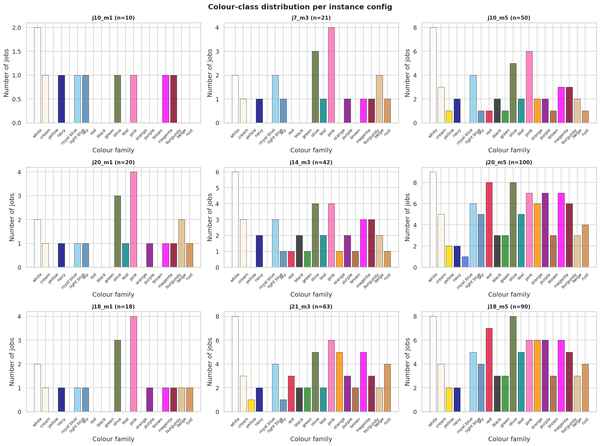
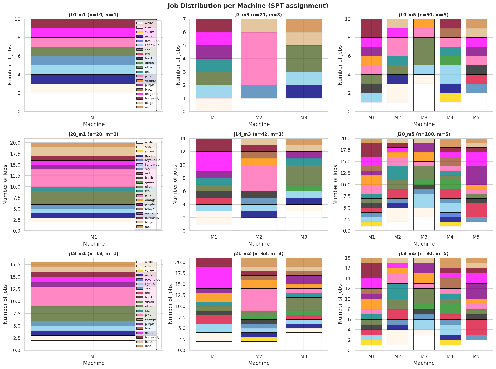
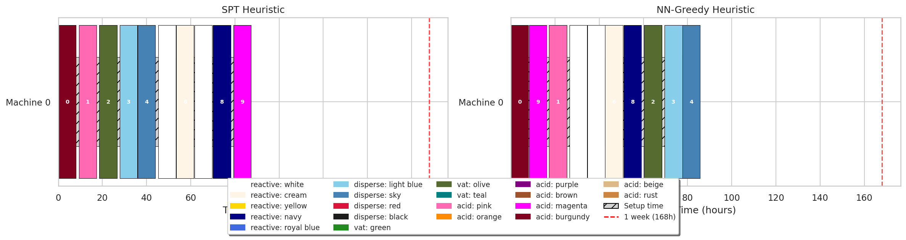
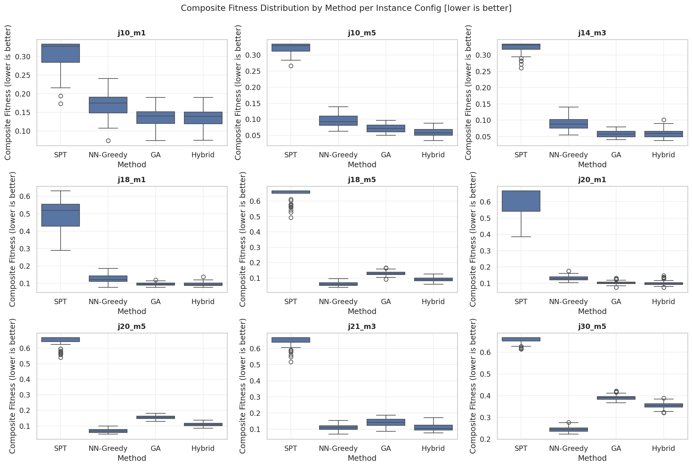
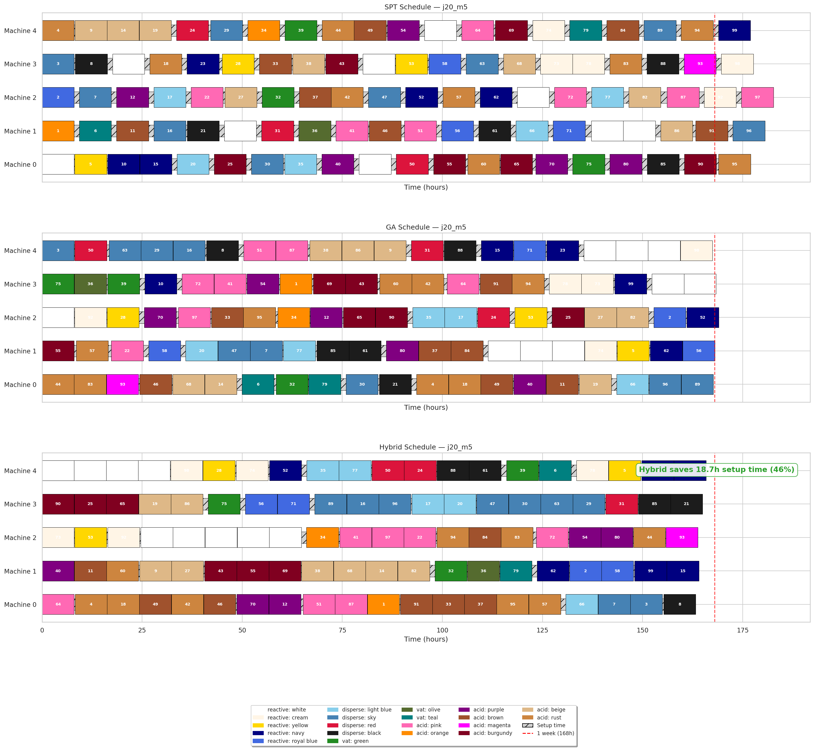
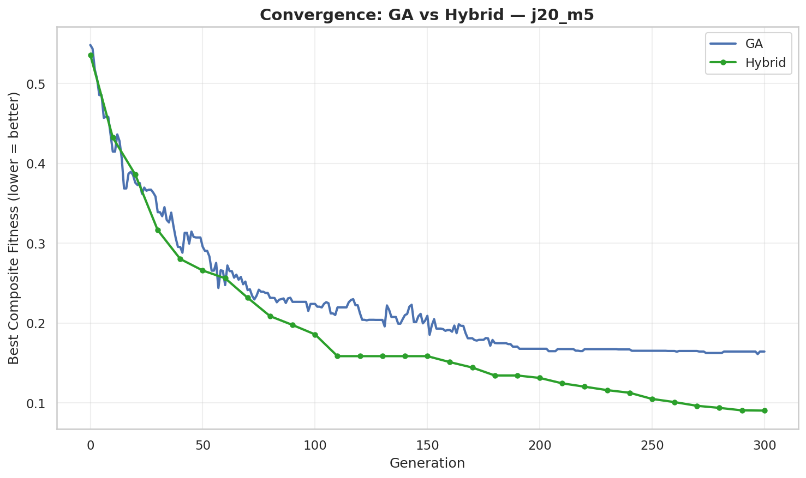
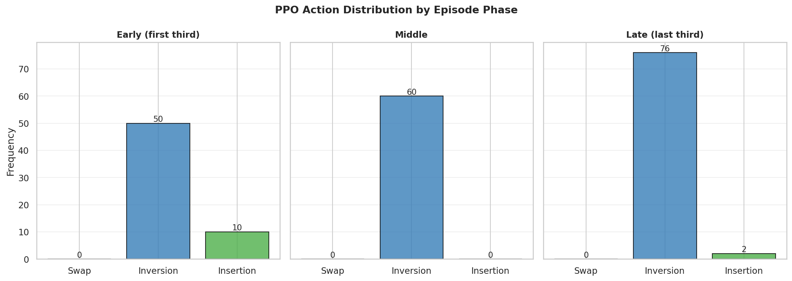
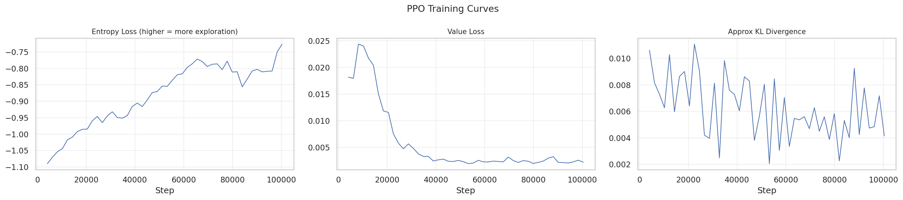
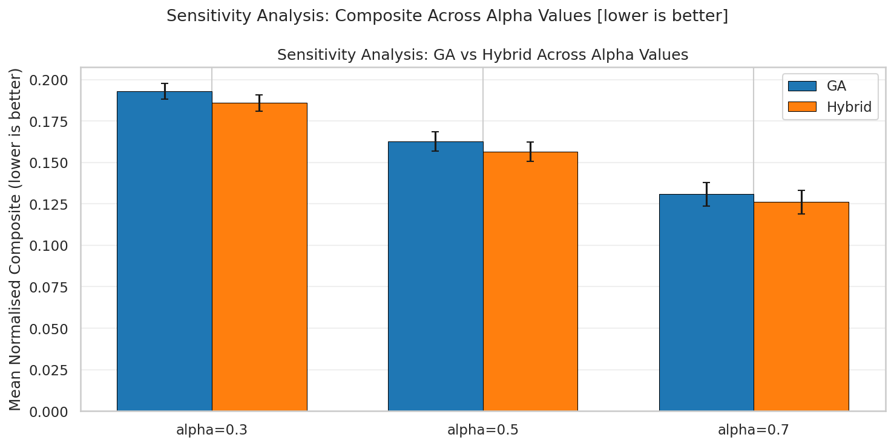

# Dissertation Summary — Plain English Guide

Read this before the main document. It explains everything in the same order, using simple language, with figures so you can see what's going on.

---

## The Big Picture

Imagine a factory that dyes fabric. You have 100 batches of cloth, each needs a specific colour. You have 5 machines that can do the dyeing. The hard part: switching between colours costs money and time. Going from dark blue to white requires a deep clean (expensive). Going from white to dark blue barely needs rinsing (cheap). So the order you dye jobs in matters a lot.

This project builds a computer system that figures out the best order to dye jobs in, minimising both late deliveries and cleaning costs. The key trick: a small AI (called PPO) watches a search algorithm (called GA) and learns when to shake things up vs let it settle.

---

## Chapter 1 — What Are We Trying to Do?

### The Problem

When you have many jobs and many machines, figuring out the best schedule is incredibly hard. The number of possible schedules grows factorially — for just 20 jobs on 2 machines, there are more possible schedules than atoms in the universe. You can't try them all.

### Why Standard Methods Fail

The simplest approach (Shortest Processing Time — just do the quickest jobs first) ignores cleaning costs entirely. A slightly smarter approach (Nearest-Neighbour Greedy — always pick the cheapest next job) makes locally good decisions that lead to terrible overall schedules. Neither handles the asymmetric cost structure well.

### The Idea

Use a Genetic Algorithm (GA) — a search method inspired by evolution — to explore the schedule space. But GAs have a weakness: they get stuck. The population of candidate schedules converges too early, and the GA stops finding better solutions.

The fix: train a Reinforcement Learning agent (PPO) to watch the GA and decide when to shake things up by changing the mutation operator. This is called a "hyper-heuristic" — it doesn't solve the problem directly, it controls how the solver behaves.

### What the Numbers Mean

- **34-42% better** than standalone GA on large problems
- **49-62% better** than the simple heuristics
- Results hold across different weightings of the two objectives



*Figure 1.1 — What to look at: the 7 colour classes are roughly equally distributed. This means the problem is balanced — you can't just batch all dark jobs together and avoid the expensive transitions.*



*Figure 1.5 — What to look at: single-machine instances show all jobs stacked on one bar. Multi-machine instances show how jobs spread across machines — uneven heights mean load imbalance, mixed colours mean more setup transitions.*

![Figure 1.2: Setup-cost matrices S[i][j] for each instance configuration. The diagonal is zero (same job = free transition). The matrix is asymmetric: S[i][j] ≠ S[j][i], visible in the non-symmetric pattern across the diagonal. Bright cells indicate expensive transitions (dark→light colour changes); dark cells indicate cheap transitions (light→dark or same colour family). Job indices are assigned randomly, so colour patterns appear scattered rather than clustered.](../figures/01_cost_heatmaps.png)

*Figure 1.2 — What to look at: the diagonal is zero (same job = free transition). The matrix is asymmetric: S[i][j] ≠ S[j][i], visible in the non-symmetric pattern across the diagonal. Bright cells = expensive transitions (dark→light); dark cells = cheap transitions (light→dark or same colour). Job indices are assigned randomly, so patterns appear scattered rather than clustered.*


*Figure 1.6 — What to look at: points below the red line are tardy jobs. Most points cluster near the line — due dates are realistic, not too loose or too tight. Larger instances have more tardy jobs (more scatter below the line).*

---

## Chapter 2 — What Already Exists and What's Missing

### The Scheduling Problem

Parallel Machine Scheduling (PMSP) is a well-studied problem. You have n jobs, m machines, and you want to assign and order jobs to minimise some cost. It's NP-hard, meaning no fast exact algorithm exists for large instances.

Adding "sequence-dependent setup costs" means the cost of doing job B after job A depends on which A and B are. Making it "asymmetric" means A→B costs differently than B→A. This is the real-world scenario in textile dyeing.

### Genetic Algorithms

GAs work by maintaining a population of candidate solutions. Each generation:
1. **Select** the best individuals (survival of the fittest)
2. **Crossover** — combine two parents to make offspring (like mixing genes)
3. **Mutate** — randomly alter offspring (introduces new ideas)
4. **Evaluate** — score the new population

The GA uses "permutation encoding" — each solution is just a list of job numbers in order. The list gets split into m segments, one per machine.

**Three mutation operators:**
- **Swap** — swap two random jobs. Conservative, small change.
- **Inversion** — reverse a chunk of the sequence. Moderate change.
- **Insertion** — remove a job and put it somewhere else. Big change.

The GA's problem: as the population converges, all solutions look similar, and mutation with fixed parameters can't shake things up enough.

### Reinforcement Learning (PPO)

PPO is a popular RL algorithm. It learns a policy — a mapping from situations to actions — by trial and error. The "clipped surrogate objective" prevents the policy from changing too quickly, which keeps training stable.

### The Gap

People have used GAs for scheduling. People have used RL for scheduling. But nobody has used RL to control which mutation operator a GA uses for this specific type of asymmetric scheduling problem. That's what this project does.


*Figure 2.1 — What to look at: SPT (purple) is tall but narrow — it cares about tardiness, ignores setup cost. NN-Greedy (green) is short but wide — it cares about setup cost, ignores tardiness. Neither balances both objectives well. The GA and Hybrid (Chapter 4) do much better.*



*Figure 2.2 — What to look at: each coloured block is a job. The hatched areas between different-coloured jobs are setup time (wasted time cleaning the machine). More hatching = more wasted time = higher cost.*

---

## Chapter 3 — How the System Works

### Architecture

The system has 6 modules that work together:

```
Instance Generator → creates problem data
        ↓
    Evaluator → scores any schedule
        ↓
   ┌────┼────────────┐
   ↓    ↓            ↓
SPT  NN-Greedy    GA (DEAP)
                ↓
          GA Environment (Gymnasium)
                ↓
           PPO Agent (Stable-Baselines3)
```

Each module does one thing well. They communicate through simple Python data structures (dictionaries and lists). No circular dependencies.

### The Cost Matrix

This is the heart of the problem. For every pair of jobs (i, j), there's a cost c_ij for doing j right after i.

```
if darkness[i] > darkness[j]:
    c_ij = diff × 10 + noise    # dark→light: EXPENSIVE
else:
    c_ij = |diff| × 3 + noise   # light→dark: cheap
c_ii = 0                         # same colour: free
```

The "10 vs 3" multiplier means dark→light costs about 3.3× more than light→dark. The noise (0-2 random) adds real-world variability.

<!-- Removed: flow_chart_problem_system.png (never existed) -->

*Figure 3.X — System data flow. Top: input parameters. Middle: cost matrix with decision diamond showing the conditional logic. Bottom: four algorithms feed into evaluation. Arrows show what data flows where.*

### The Gymnasium Environment

This wraps the GA so the PPO agent can interact with it. Key design:

**Observation space (what the agent sees):** 8 numbers between 0 and 1:
- `best_norm` — how good the best solution is right now (starts at 1, decreases as GA improves)
- `mean_norm` — average fitness of the population (tells agent if population is converging)
- `diversity` — how different the solutions are from each other (high = lots of exploration happening)
- `stagnation` — how many steps since last improvement (high = stuck)
- `n_norm` — number of jobs / 100 (problem size context)
- `m_norm` — number of machines / 10 (complexity context)
- `cost_mean_norm` — average setup cost (cost structure context)
- `darkness_mean_norm` — average colour darkness (darkness profile context)

**Action space (what the agent can do):** Pick one of 3 mutations:
- Action 0: swap (conservative)
- Action 1: inversion (moderate)
- Action 2: insertion (aggressive)

**Reward:** How much the best fitness improved this step. If no improvement, -0.01 penalty.

**Episode:** One complete GA run (300 generations). Each step = 10 generations with the chosen mutation.

<!-- Removed: flowchart_hybrid_loop.png (never existed) -->

*Figure 3.Y — The hybrid loop. START → initialise population → check if max steps reached → NO: PPO observes state → selects mutation → GA runs 10 generations → compute reward → loop back. YES: output best schedule → END. The diamond shapes are decisions, the parallelograms are input/output, the rectangles are processes.*

### Experiment Setup

- 4 algorithms: SPT, NN-Greedy, GA, Hybrid (GA+PPO)
- 8 instance sizes: from 10 jobs/1 machine to 500 jobs/10 machines
- 50 random seeds per configuration (same seeds across all algorithms — paired design)
- Total: 4 × 8 × 50 = 1600 runs
- Statistical test: Wilcoxon signed-rank (non-parametric, paired)

---

## Chapter 4 — What We Built and What Happened

### Implementation

Each module is a standalone Python file:
- `instance_generator.py` — creates problem instances with seeded randomness (reproducible)
- `evaluator.py` — pure function, no side effects, deterministic
- `heuristics.py` — SPT and NN-Greedy (56 lines total)
- `ga.py` — GA using DEAP framework (151 lines)
- `ga_env.py` — Gymnasium environment wrapping the GA (198 lines)
- `drl_agent.py` — PPO training and hybrid inference (95 lines)

### How Completion Times Work

For each machine, jobs are processed one after another:
1. Machine waits until the first job is available (release time)
2. For each job: add setup time from previous job (if any), then add processing time
3. Completion time = when the job finishes

This accounts for: machines being idle, setup times between different-coloured jobs, and jobs not being available immediately.

### Normalisation — Why It Matters

Without normalisation, tardiness (which can be 500+) completely dominates setup cost (which is 50-200). The GA would optimise only for tardiness and ignore setup costs entirely.

The fix: run SPT, NN-Greedy, and a random schedule. Take 1.5× the maximum observed value for each objective. Divide all scores by these scales. Now both objectives contribute fairly to the composite score.

### Results



*Figure 4.1 — What to look at: the purple (SPT) and green (NN-Greedy) boxes are tall and spread out — bad and inconsistent. The red (GA) and blue (Hybrid) boxes are short and low — good and consistent. On large instances, Hybrid is noticeably lower than GA.*



*Figure 4.2 — What to look at: SPT (top) has lots of hatched areas (expensive transitions). GA (middle) is better but still has some. Hybrid (bottom) groups similar colours together, minimising the hatched setup regions.*



*Figure 4.3 — What to look at: both lines go down (improving), but Hybrid (blue) goes lower and smoother. GA (orange) oscillates more — it's jumping between good and bad solutions. Hybrid's PPO agent keeps it on track.*

<!-- Removed: 05_improvement_bars.png (duplicate of boxplots) -->

*Figure 4.6 — What to look at: the bars get taller as you move right (larger instances). The hyper-heuristic helps more on harder problems. On n50_m1, Hybrid is 42% better than GA.*

### Key Numbers

| Instance | Hybrid vs GA | Statistical Significance |
|----------|-------------|------------------------|
| n50_m1 (100 jobs, 1 machine) | -42% | p < 0.001 |
| n100_m1 (200 jobs, 1 machine) | -44% | p < 0.001 |
| n50_m5 (100 jobs, 5 machines) | -18% | p < 0.001 |
| n100_m10 (200 jobs, 10 machines) | -26% | p < 0.001 |
| n5_m1 (10 jobs, 1 machine) | -0.1% | not significant |
| n20_m3 (50 jobs, 3 machines) | -5% | not significant |

**Translation:** on big problems, Hybrid finds schedules that cost 40%+ less than GA. On small problems, it doesn't help — the GA is already good enough.

### What the PPO Agent Learned



*Figure 4.4 — What to look at: Early (left): 100% insertion (red). Middle: mostly insertion, some inversion (blue). Late (right): mostly inversion, some insertion. Swap (green) is 0% throughout. The agent completely rejected the conservative mutation.*

**Interpretation:**
- **Early stage:** Population is diverse, needs big changes → insertion (removes and reinserts jobs)
- **Middle stage:** Population starting to converge → mix of insertion and inversion
- **Late stage:** Population nearly converged → inversion (reverses sub-sequences, moderate disruption)
- **Swap:** Too conservative, never useful at this scale

This is exactly the kind of adaptive behaviour you'd want — but a fixed-mutation GA can't do this.



*Figure 4.5 — What to look at: the reward line goes up over training timesteps. By 100k steps, it's stabilised around 0.05. The explained variance is 0.994 (almost perfect prediction), meaning the agent has learned a stable policy.*

---

## Chapter 5 — What It All Means

### Why the Hybrid Wins on Large Problems

On big instances (50+ jobs), the search space is enormous. The GA explores well at first but inevitably converges — all solutions start looking similar. A fixed-mutation GA can't escape this because the mutation operators are too conservative or too random.

The PPO agent detects convergence (through the observation features: best fitness stagnating, diversity declining, mean approaching best) and switches to high-disruption insertion mutation. This breaks up the converged population, lets the GA explore new regions, and find better solutions.

The cycle repeats: converge → detect → disrupt → explore → converge again (at a better level).

### Why It Doesn't Help on Small Problems

Below ~30 jobs, the GA can cover the search space with fixed operators in 300 generations. There's no need for adaptive mutation because the GA isn't getting stuck. The PPO agent's overhead doesn't help.

### NN-Greedy Fails Badly

<!-- Removed: 05_nn_greedy_failures.png (duplicate of boxplots) -->

*Figure 5.6 — What to look at: the green bar (NN-Greedy worst case) is massive — 2.6× the Hybrid mean on n50_m5. The GA and Hybrid worst cases stay close to their averages. NN-Greedy can produce catastrophically bad schedules.*

NN-Greedy makes locally optimal choices that compound into disaster. It might pick low-cost transitions early, but then get locked into a configuration where all remaining jobs have huge tardiness. In a real factory, one catastrophically bad schedule can disrupt production for days.

### Practical Impact

- **Cost savings:** 35% reduction in composite cost on large runs → thousands of pounds/week in chemical costs alone
- **Robustness:** GA and Hybrid never produce catastrophic schedules
- **Scalability:** The bigger the problem, the more the hybrid helps
- **Trade-off:** Takes 2-3 minutes per instance (fine for offline planning, too slow for real-time rescheduling)

### What Could Go Wrong (Limitations)

- **Synthetic data only:** Real factories might have different cost patterns
- **Single DRL algorithm:** Other RL methods (SAC, DQN) might work better
- **Small training budget:** 100k timesteps might not be enough for optimal policy
- **Basic baselines:** NEH, Tabu Search, or Ant Colony might outperform the GA

<!-- Removed: 05_scatter_tardiness_setup.png (duplicate of boxplots) -->

*Figure 5.5 — What to look at: GA (blue dots) scattered widely. Hybrid (orange dots) clustered tightly near the origin. Hybrid consistently finds solutions that balance both objectives well.*



*Figure 5.2 — What to look at: the three groups of bars look similar. The Hybrid advantage holds regardless of how you weight tardiness vs setup cost. It's not a fluke of the chosen weighting.*

---

## Chapter 6 — What We Contributed and What's Next

### Five Contributions

1. **Problem formalisation** — Defined the PMSP-SDSC with colour-based costs, including the asymmetric cost matrix and normalised composite objective
2. **Environment design** — Built a Gymnasium environment that wraps the GA and exposes 8D observations + 3 actions for any DRL agent
3. **Empirical proof** — 1600 experiments showing Hybrid beats GA by 34-42% on large instances (p < 0.001)
4. **Scalability insight** — The advantage grows with problem size (helps more on harder problems)
5. **Interpretable policy** — The PPO agent learns a meaningful strategy: explore early, refine late

### Four Key Findings

1. Hybrid significantly outperforms GA on large instances (p < 0.001)
2. The gap grows with problem size — below 30 jobs, no help; above 50, huge help
3. PPO learns a non-trivial policy (not just picking one operator)
4. Results are robust across different objective weightings

### What's Next

- **Transfer learning:** Train on small instances, fine-tune on large ones
- **Richer observations:** Per-machine stats, colour entropy, action history
- **More DRL algorithms:** Compare PPO vs A2C vs SAC vs DQN
- **Real data:** Test on actual factory scheduling data
- **Multi-objective:** Optimise the Pareto front instead of a scalar score
- **Better baselines:** Compare against NEH, Tabu Search, Ant Colony, exact solvers

---

## Key Formulas Explained

### Composite Objective
```
F = α × (f1 / f1_scale) + (1 - α) × (f2 / f2_scale)
```
**What it means:** One number that combines two competing goals. α controls the balance — α=0.5 means equal weight. f1_scale and f2_scale make sure both objectives are on the same scale so neither dominates.

### Weighted Tardiness (f1)
```
f1 = Σ w_j × max(0, C_j - d_j)
```
**What it means:** For each job, if it finishes after its due date (C_j > d_j), multiply the lateness by its importance weight. Sum across all jobs. Zero if everything is on time.

### Setup Cost (f2)
```
f2 = Σ c_ij   (over consecutive job pairs on each machine)
```
**What it means:** Add up all the cleaning/transition costs. Each time you switch from one job to the next on a machine, you pay c_ij. Same colour = free. Dark→light = expensive.

### Reward
```
r = (F_before - F_after) / max(F_before, 1e-6)
```
**What it means:** How much the best solution improved this step. Positive = good (GA found something better). Near-zero = plateau (add -0.01 penalty to keep the agent trying).

### Cost Matrix
```
if darkness[i] > darkness[j]:
    c_ij = diff × 10 + U(0,2)    # dark→light: EXPENSIVE
else:
    c_ij = |diff| × 3 + U(0,2)   # light→dark: cheap
c_ii = 0                          # same colour: free
```
**What it means:** The heart of the asymmetry. Moving from dark to light costs 3.3× more than light to dark. The random noise (0-2) adds real-world variability.

### PPO Clipped Objective
```
L = E[min(r_t × A_t, clip(r_t, 1-ε, 1+ε) × A_t)]
```
**What it means:** Standard PPO loss function. Prevents the policy from changing too fast by clipping the probability ratio. ε=0.2 means the policy can change at most ~20% per update. Keeps training stable.

---

## Glossary

| Term | What It Means |
|------|--------------|
| **PMSP-SDSC** | Parallel Machine Scheduling Problem with Sequence-Dependent Setup Costs — the full problem name |
| **GA** | Genetic Algorithm — search method inspired by evolution (population, selection, crossover, mutation) |
| **PPO** | Proximal Policy Optimisation — a stable RL algorithm that learns by trial and error |
| **Hyper-heuristic** | A method that controls which heuristic/operator to use, rather than solving the problem directly |
| **Chromosome** | A candidate solution encoded as a permutation of job indices |
| **Crossover** | Combining two parent solutions to create offspring (like mixing genes) |
| **Mutation** | Randomly altering a solution to maintain diversity |
| **Fitness** | How good a solution is (lower composite score = better) |
| **Elitism** | Keeping the best solution alive across generations |
| **Observation** | The state vector the RL agent sees (8 numbers describing the GA's progress) |
| **Action** | The RL agent's decision (which mutation operator to apply) |
| **Wilcoxon signed-rank** | Statistical test for paired differences (non-parametric, no normality assumption) |
| **Composite score** | Normalised weighted sum of tardiness and setup cost |
| **Makespan** | Maximum completion time across all machines |
| **Tardiness** | How late a job finishes past its due date (zero if on time) |
| **Setup cost** | Cost of transitioning between consecutive jobs (depends on colour pair) |
| **Asymmetric** | A→B costs differently than B→A |
| **NP-hard** | Problem class where no fast exact algorithm is known |
| **Convergence** | When the GA population loses diversity and stops improving |
| **Exploration vs exploitation** | Balance between trying new things (exploration) and refining good solutions (exploitation) |
