# Flow Chart — Concrete Data-Flow Pipeline

## Mermaid Diagram

Renders automatically in GitHub, GitLab, VS Code, Obsidian.

```mermaid
flowchart TD
    %% ══════════════════════════════════════════════════════════════
    %%  INPUT
    %% ══════════════════════════════════════════════════════════════
    subgraph INPUT ["INPUT"]
        direction TB
        I1["Instance: n jobs · m machines\nn = {5,10,20,50}   m = {5}"]
        I2["Per job:  p_j · d_j · w_j\no_j = Lab+RGB+CM (8D)\nκ_j ∈ {direct, reactive, vat, acid}"]
        I3["Config: α ∈ [0,1]\nprofile ∈ {baseline, realistic}"]
        I4["GA:  pop=100  gens=300\n     OX p=0.9  tourn k=3"]
        I5["PPO: obs=8D  actions=3\n     lr=3e-4  ent_coef=0.05"]
    end

    %% ══════════════════════════════════════════════════════════════
    %%  COST MATRIX
    %% ══════════════════════════════════════════════════════════════
    subgraph COST ["COST MATRIX  c_ij"]
        direction TB
        C1["c_ij = max(0, ΔL)          ← lightness penalty"]
        C2["     + |Δcolor| / 8        ← avg channel diff"]
        C3["     + δ(κ_i, κ_j)        ← chemistry mismatch"]
        C4["     + ε_ij                ← noise"]
        C5["δ(κ_i,κ_j) = 0 same | 0.5 compat | 1.0 clash"]
        C6["ε_ij ~ Beta(1,10) × 0.3"]
        C7["Shape: n×n matrix"]
    end

    %% ══════════════════════════════════════════════════════════════
    %%  ALGORITHMS
    %% ══════════════════════════════════════════════════════════════
    subgraph ALG ["SOLUTION APPROACHES"]
        direction LR

        subgraph SPT ["SPT"]
            direction TB
            S1["input: n, m, p_j"]
            S2["sort jobs by p_j ↑"]
            S3["round-robin assign\nto m machines"]
            S4["output: schedule"]
        end

        subgraph NNG ["NN-Greedy"]
            direction TB
            N1["input: n, m, c_ij"]
            N2["pick first unassigned job"]
            N3["append to machine that\nminimises c_ij to last job"]
            N4["repeat n times"]
            N5["output: schedule"]
        end

        subgraph GA_BLOCK ["GA (DEAP)"]
            direction TB
            G1["init: N random permutations"]
            G2["eval: F = α·f₁/f̂₁ + (1-α)·f₂/f̂₂"]
            G3["tournament select (k=3)"]
            G4["OX crossover (p=0.9)"]
            G5["mutate: swap|inv|insert"]
            G6["elitism: keep top 1"]
            G7["repeat 300 gens"]
            G8["output: best schedule + F"]
        end

        subgraph PPO_BLOCK ["GA + PPO"]
            direction TB
            P1["same GA loop"]
            P2["obs_t = [gen/F/norm/α/div/pop/...]\n       ∈ ℝ⁸"]
            P3["action_t = PPO(obs_t)\n  → select mutation op"]
            P4["reward_t = F_t − F_{t−1}"]
            P5["train PPO every 2048 steps"]
            P6["output: best schedule + F"]
        end
    end

    %% ══════════════════════════════════════════════════════════════
    %%  EVALUATION / OUTPUT
    %% ══════════════════════════════════════════════════════════════
    subgraph EVAL ["OUTPUT / EVALUATION"]
        direction TB
        O1["best schedule S*:\nper-machine job sequence"]
        O2["composite score F = α·f₁/f̂₁ + (1-α)·f₂/f̂₂"]
        O3["f₁ = weighted tardiness Σ w_j T_j"]
        O4["f₂ = total setup cost Σ c_ij"]
        O5["Wilcoxon signed-rank vs each baseline\np-value at α=0.05"]
        O6["box plots · Gantt charts\nsensitivity: α×config×30 seeds"]
    end

    %% ══════════════════════════════════════════════════════════════
    %%  EDGES
    %% ══════════════════════════════════════════════════════════════
    INPUT --> COST
    COST --> SPT
    COST --> NNG
    COST --> GA_BLOCK
    COST --> PPO_BLOCK
    SPT --> EVAL
    NNG --> EVAL
    GA_BLOCK --> EVAL
    PPO_BLOCK --> EVAL

    %% ══════════════════════════════════════════════════════════════
    %%  STYLING
    %% ══════════════════════════════════════════════════════════════
    classDef inputStyle  fill:#FFF3E0,stroke:#E65100,stroke-width:2px,color:#333
    classDef costStyle   fill:#E3F2FD,stroke:#1565C0,stroke-width:2px,color:#333
    classDef sptStyle    fill:#F3E5F5,stroke:#7B1FA2,stroke-width:2px,color:#333
    classDef nngStyle    fill:#F3E5F5,stroke:#7B1FA2,stroke-width:2px,color:#333
    classDef gaStyle     fill:#E8F5E9,stroke:#2E7D32,stroke-width:2px,color:#333
    classDef ppoStyle    fill:#FFEBEE,stroke:#C62828,stroke-width:2px,color:#333
    classDef evalStyle   fill:#F9FBE7,stroke:#F57F17,stroke-width:2px,color:#333

    class INPUT inputStyle
    class COST costStyle
    class SPT sptStyle
    class NNG nngStyle
    class GA_BLOCK gaStyle
    class PPO_BLOCK ppoStyle
    class EVAL evalStyle
```



## Data Flow Summary

| Stage                 | Input →               | Operation                           | → Output                             |
| --------------------- | ---------------------- | ----------------------------------- | ------------------------------------- |
| **Instance**    | n, m, jobs             | `InstanceGenerator`               | job params (p_j, d_j, w_j, o_j, κ_j) |
| **Cost matrix** | o_j, κ_j              | `c_ij = max(0,ΔL) +                | Δcolor                               |
| **SPT**         | n, m, p_j              | sort + round-robin                  | schedule                              |
| **NN-Greedy**   | n, m, c_ij             | greedy min c_ij                     | schedule                              |
| **GA**          | n, m, C, pop=100       | OX crossover + mutate + elitism     | best schedule + F                     |
| **GA+PPO**      | same GA + PPO          | PPO selects mutation op from 8D obs | best schedule + F                     |
| **Eval**        | schedules vs baselines | Wilcoxon signed-rank (α=0.05)      | p-values, box plots, Gantt            |

## Usage in Thesis

```latex
\begin{figure}[htbp]
    \centering
    \includegraphics[width=\textwidth]{figures/flow_chart_problem_system}
    \caption{Concrete data-flow pipeline: input data, cost matrix computation,
             solution algorithms, and evaluation outputs.}
    \label{fig:flow_problem_system}
\end{figure}
```
