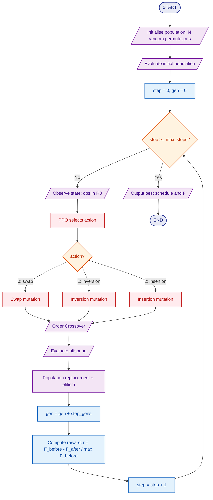

# Flowchart — GA+PPO Hybrid Loop

## Mermaid Diagram

```mermaid
flowchart TD
    START([START]) --> INIT[/"Initialise population: N random permutations"/]
    INIT --> EVAL_INIT[/Evaluate initial population/]
    EVAL_INIT --> STEP_SET["step = 0, gen = 0"]
    STEP_SET --> DEC_MAX{step >= max_steps?}

    DEC_MAX -->|"No"| OBSERVE[/"Observe state: obs in R8"/]

    OBSERVE --> SELECT["PPO selects action"]
    SELECT --> ACTION{action?}

    ACTION -->|"0: swap"| MUT_SWAP["Swap mutation"]
    ACTION -->|"1: inversion"| MUT_INV["Inversion mutation"]
    ACTION -->|"2: insertion"| MUT_INS["Insertion mutation"]

    MUT_SWAP --> CROSSOVER
    MUT_INV --> CROSSOVER
    MUT_INS --> CROSSOVER

    CROSSOVER[/Order Crossover/]
    CROSSOVER --> EVAL_OFF[/Evaluate offspring/]
    EVAL_OFF --> REPLACE["Population replacement + elitism"]
    REPLACE --> GEN_INC["gen = gen + step_gens"]
    GEN_INC --> REWARD["Compute reward: r = F_before - F_after / max F_before"]
    REWARD --> STEP_INC["step = step + 1"]
    STEP_INC --> DEC_MAX

    DEC_MAX -->|"Yes"| OUTPUT[/"Output best schedule and F"/]
    OUTPUT --> END([END])

    classDef terminal fill:#E8EAF6,stroke:#283593,stroke-width:2px,color:#1A237E
    classDef process fill:#E3F2FD,stroke:#1565C0,stroke-width:1.5px,color:#0D47A1
    classDef decision fill:#FFF3E0,stroke:#E65100,stroke-width:2px,color:#BF360C
    classDef io fill:#F3E5F5,stroke:#7B1FA2,stroke-width:1.5px,color:#4A148C
    classDef ppo fill:#FFEBEE,stroke:#C62828,stroke-width:2px,color:#B71C1C
    classDef ga fill:#E8F5E9,stroke:#2E7D32,stroke-width:2px,color:#1B5E20

    class START,END terminal
    class STEP_SET,GEN_INC,STEP_INC,REWARD process
    class DEC_MAX,ACTION decision
    class INIT,EVAL_INIT,OBSERVE,CROSSOVER,EVAL_OFF,REPLACE,OUTPUT io
    class MUT_SWAP,MUT_INV,MUT_INS ppo
    class SELECT ppo
```

## Usage in Dissertation

